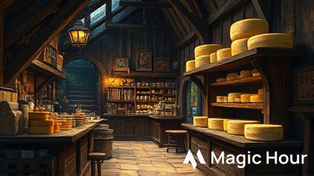
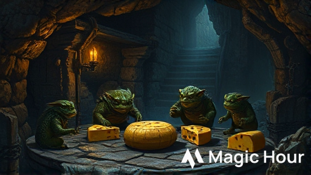

# La Consegna del Formaggio
## Avventura One-Shot per D&D 5e



---

## 📋 Informazioni Generali

**Durata:** 3 ore (4-5 scene)  
**Livello personaggi:** 1  
**Giocatori:** 4-5 + Dungeon Master  
**Ambientazione:** Phandalin, Forgotten Realms  
**Temi:** Investigazione leggera, combattimento, problem solving  

**Bilanciamento:**
- Investigazione: 3/10
- Combattimento: 4/10  
- Enigmi/Abilità: 3/10

---

## 🎯 Sinossi

I personaggi vengono ingaggiati da Elsa Greenbarrel, proprietaria della Casera di Phandalin, per consegnare un carico prezioso di formaggi stagionati al Sindaco di Neverwinter per un banchetto importante. Quella che doveva essere una semplice consegna si trasforma in un'avventura quando i PG scoprono che il carro è stato assaltato da creature inaspettate: un gruppo di Kobold golosi che hanno sviluppato un'ossessione per il formaggio stagionato.

---

## 🎭 PNG Principali

### Elsa Greenbarrel
**Ruolo:** Proprietaria della Casera di Phandalin  
**Razza:** Halfling  
**Allineamento:** Legale Buono  

**Descrizione:** Una halfling robusta sulla cinquantina, con le mani callose dal lavoro e un sorriso sempre pronto. Indossa un grembiule macchiato di caglio e ha i capelli raccolti in una crocchia pratica.

**Personalità:**  
- Orgogliosa del suo lavoro e dei suoi formaggi
- Generosa ma pratica
- Parla con entusiasmo dei suoi prodotti

**Dialogo di introduzione:**
> "Ah, finalmente! Siete gli avventurieri che cercavo! Vedete, ho un problema... anzi, un'opportunità! Il Sindaco di Neverwinter ha ordinato i miei migliori formaggi per un banchetto, ma il mio solito trasportatore si è ammalato. Pagate voi 50 monete d'oro per portare il carico sano e salvo a Neverwinter? È a solo mezzo giorno di viaggio, e i miei formaggi sono ben confezionati!"

**Informazioni aggiuntive che può fornire:**
- I formaggi sono molto preziosi (valore totale: 200 mo)
- La strada è generalmente sicura
- Il viaggio dovrebbe durare circa 4-5 ore
- Se i formaggi arrivano integri entro domani, riceverà un bonus di 100 mo dal Sindaco

---

### Glim "Puzzolente"
**Ruolo:** Leader dei Kobold ladri di formaggio  
**Razza:** Kobold  
**Allineamento:** Caotico Neutrale  

**Descrizione:** Un kobold più grosso della media, con squame marrone-rossastre e un odore pungente di formaggio andato a male. Indossa un collare fatto di cortecce di formaggio stagionato.

**Personalità:**
- Astuto ma vigliacco
- Ossessionato dal formaggio
- Disposto a negoziare se messo alle strette

**Dialogo se catturato:**
> "Sssì, sssì! Glim ha preso formaggio! Ma è per buona ragione! Tribù ha fame, e questo formaggio... mmm... molto buono! Puzzolente come uova di drago, ma saporito! Voi lasciare Glim tenere uno? Solo uno? Glim vi mostra dove altri!"

---

## 📍 Struttura dell'Avventura

### Diagramma di Flusso

```
INIZIO: Phandalin → Casera di Elsa
         ↓
SCENA 1: L'Incarico → Accettare la missione
         ↓
SCENA 2: La Partenza → Viaggio verso Neverwinter
         ↓
SCENA 3: Il Carro Rovesciato → [INVESTIGAZIONE]
         ↓
    Prove di traccia/Sopravvivenza
         ↓
SCENA 4: La Tana dei Kobold → [SCELTA]
         ├→ Negoziare con Kobold
         ├→ Infiltrazione furtiva
         └→ Combattimento diretto
         ↓
SCENA 5: Il Recupero → [COMBATTIMENTO o DIPLOMAZIA]
         ↓
CONCLUSIONE: Ritorno e Ricompensa
```

---

## 🎬 Scene Dettagliate

### SCENA 1: L'Incarico alla Casera
**Luogo:** Casera di Elsa Greenbarrel, Phandalin  
**Durata:** 15-20 minuti  

**Box Testuale da Leggere:**
> *Entrando nella Casera di Elsa, vi avvolge un profumo intenso e pungente di formaggio stagionato. Scaffali di legno lungo le pareti sostengono dozzine di forme di formaggio di varie dimensioni, alcune coperte di cera rossa, altre con muffe verdastre che testimoniano la loro lunga stagionatura. Al centro della stanza, una halfling robusta sta confezionando con cura una grande forma in un panno di lino.*
>
> *Alzando lo sguardo, vi sorride: "Ah, finalmente! Siete gli avventurieri che cercavo!"*

**Sviluppo:**
1. Elsa spiega la situazione e offre 50 mo per la consegna
2. I PG possono negoziare (CD 12 Persuasione per ottenere 60 mo)
3. Elsa carica il carro con 12 forme di formaggio, del valore complessivo di 200 mo

**Informazioni che i PG possono ottenere:**
- La strada per Neverwinter è normalmente sicura (CD 10 Intelligenza-Storia)
- Il formaggio ha un odore molto forte (tutti lo notano)
- Elsa menziona che alcuni goblin sono stati visti nei boschi recentemente

**Punti chiave:**
- Se i PG chiedono di assaggiare il formaggio, Elsa offre un pezzo: è delizioso ma ha un odore fortissimo
- Elsa fornisce un carro trainato da un mulo chiamato "Toby"
- Consegna una lettera sigillata per il Sindaco di Neverwinter

---

### SCENA 2: La Partenza
**Luogo:** Strada da Phandalin a Neverwinter  
**Durata:** 10 minuti  


**Box Testuale da Leggere:**
> *La strada che porta a Neverwinter si snoda dolcemente tra campi coltivati e piccoli boschi. Il sole del mattino è piacevole, e Toby il mulo procede con passo sicuro, trascinando il carro carico di formaggi. L'odore pungente dei formaggi stagionati vi accompagna, impossibile da ignorare.*
>
> *Dopo circa un'ora di viaggio, la strada entra in una zona più boscosa. Gli alberi si infittiscono ai lati, creando zone d'ombra. È in questo punto che Toby si ferma improvvisamente, nitrendo nervosamente.*

**Sviluppo:**
1. **Percezione Passiva 12+:** I PG notano tracce di lotta sulla strada davanti a loro
2. **Percezione Attiva CD 10:** Vedono un carro rovesciato circa 30 metri più avanti
3. **Percezione Attiva CD 15:** Notano piccole impronte di creature umanoidi (kobold) che entrano nel bosco

**Prove di Abilità:**
- **Addestrare Animali CD 10:** Calmare Toby (altrimenti si innervosisce e può tentare di fuggire)
- **Natura CD 12:** Riconoscere che l'odore forte del formaggio può attirare creature

---

### SCENA 3: Il Carro Rovesciato - INVESTIGAZIONE
**Luogo:** Strada, zona boscosa  
**Durata:** 20-30 minuti  


**Box Testuale da Leggere:**
> *Avvicinandovi, vedete un carro simile al vostro, rovesciato su un lato. Le ruote girano ancora lentamente. Attorno sono sparse casse rotte e, sorprendentemente, diverse forme di formaggio con morsi evidenti. Il tessuto che copriva il carico è strappato in più punti. Non c'è traccia del conducente o del mulo che trainava il carro.*
>
> *Dall'interno del bosco, sentite strani versi acuti e quello che sembra il rumore di creature che masticano.*

**Punti d'Interesse:**
1. **Il Carro Rovesciato:**
   - Sopravvivenza CD 12: Tracce mostrano che 6-8 creature piccole hanno attaccato
   - Investigazione CD 10: Trovano scaglie di kobold sui tessuti strappati
   - Percezione CD 15: Notano tracce di artigli su alcune forme di formaggio

2. **I Formaggi Mordicchiati:**
   - Natura CD 10: I morsi sono di creature piccole con denti affilati
   - Investigazione CD 12: Alcune forme sono state trascinate verso il bosco

3. **Le Tracce nel Bosco:**
   - Sopravvivenza CD 10: Le tracce portano a nord-est nel bosco
   - Sopravvivenza CD 15: Identificano le tracce come di kobold
   - Le tracce sono fresche (meno di un'ora)

**Prove di Caratteristica:**
- **Medicina CD 10:** Sul carro trovano tracce di sangue (non umano)
- **Indagare CD 12:** Trovano una piccola sacca con 15 mr e una nota che dice "Consegna per Barthen"

**Scelte dei Giocatori:**
A. Seguire le tracce nel bosco  
B. Continuare verso Neverwinter e ignorare l'incidente  
C. Tornare a Phandalin per chiedere aiuto  
D. Nascondere il proprio carro e investigare furtivamente

**Risultati:**
- **A o D:** Procedono alla Scena 4
- **B:** Dopo 30 minuti vengono anche loro attaccati dai kobold (passare a combattimento casuale)
- **C:** Perdono troppo tempo, l'avventura fallisce (scelta poco probabile)

---

### SCENA 4: La Tana dei Kobold - ESPLORAZIONE
**Luogo:** Piccola grotta nel bosco  
**Durata:** 30-40 minuti  


**Box Testuale da Leggere:**
> *Le tracce vi conducono per circa venti minuti attraverso il bosco, fino a un piccolo affioramento roccioso. Tra le rocce si apre l'imboccatura di una grotta, larga abbastanza per farvi passare chinati. Un odore intenso di formaggio marcio esce dalla grotta, mescolato all'odore caratteristico dei kobold: un mix di terra umida e zolfo.*
>
> *Dall'interno sentite voci acute che gracchiano in draconico, intervallate da versi di soddisfazione e rutti.*

**Mappa della Tana:**
```
    [Ingresso]
        |
        v
    [Camera 1: Guardie] (2 Kobold)
        |
        v
    [Camera 2: Deposito] (4 Kobold + Glim)
        |
        v
    [Camera 3: Tesoro/Formaggio]
```

**Approcci possibili:**

#### OPZIONE A: Infiltrazione Furtiva
**Prove richieste:**
- Furtività CD 13 (con svantaggio per l'odore forte del formaggio se hanno toccato i formaggi)
- Percezione CD 10 per individuare le guardie
- Furtività CD 15 per raggiungere la camera del deposito

**Esito Successo:** Possono recuperare i formaggi senza combattere  
**Esito Fallimento:** Le guardie allertano gli altri kobold, inizia il combattimento

#### OPZIONE B: Negoziazione
**Prove richieste:**
- Persuasione CD 14 per convincere i kobold a restituire i formaggi
- Intimidazione CD 12 per spaventarli
- Inganno CD 15 per ingannarli con false promesse

**Esito Successo:** I kobold accettano di scambiare i formaggi per cibo (o 1-2 forme)  
**Esito Fallimento:** I kobold attaccano, offesi

#### OPZIONE C: Combattimento Diretto
Procede direttamente alla Scena 5

**Informazioni in Draconico:**
Se un PG parla Draconico, sente:
> "Glim ha trovato tesoro puzzolente ma buono! Capo draconico sarà fiero!"

---

### SCENA 5: Il Confronto Finale - COMBATTIMENTO/DIPLOMAZIA
**Luogo:** Camera del Deposito nella tana  
**Durata:** 30-40 minuti  



**Box Testuale da Leggere (se entrano in combattimento):**
> *Irrompendo nella camera più ampia, vedete una scena quasi comica: quattro kobold sono seduti in cerchio attorno a un mucchio di forme di formaggio, alcune già mezzo mangiate. Stanno discutendo animatamente in draconico, gesticolando verso le loro prede. Al centro, un kobold più grande degli altri - presumibilmente il loro leader - tiene stretto un pezzo di formaggio come fosse un tesoro.*
>
> *Al vostro arrivo, tutti si girano di scatto. Il leader emette un grido acuto: "Intrusssi! Proteggere il tesssoro puzzzzolente!"*

**COMBATTIMENTO:**

**Iniziativa:** Tirare iniziativa

**Nemici:**
- Glim "Puzzolente" (Kobold con HP potenziati)
- 4 Kobold normali
- 2 Kobold in arrivo al round 3 (se il combattimento non è finito)

**Statistiche - Kobold Standard:**
```
Kobold
Piccolo umanoide (kobold), legale malvagio
CA 12 (armatura di pelle)
Punti Ferita 5 (2d6 - 2)
Velocità 9 m

FOR 7 (-2) | DES 15 (+2) | COS 9 (-1)
INT 8 (-1) | SAG 7 (-2) | CAR 8 (-1)

Sensi: Scurovisione 18 m, Percezione passiva 8
Linguaggi: Comune, Draconico
GS: 1/8 (25 PE)

Tattiche di Branco: Il kobold ha vantaggio ai tiri per colpire contro una creatura se almeno un alleato è entro 1,5m dalla creatura e non è incapacitato.

Sensibilità alla Luce Solare: In luce solare diretta, il kobold ha svantaggio agli attacchi e prove di Saggezza (Percezione) basate sulla vista.

AZIONI:
Pugnale: Attacco con arma da mischia: +4 al colpire, portata 1,5 m, un bersaglio.
Colpito: 4 (1d4+2) danni perforanti.

Fionda: Attacco con arma a distanza: +4 al colpire, gittata 9/36 m, un bersaglio.
Colpito: 4 (1d4+2) danni contundenti.
```

**Statistiche - Glim "Puzzolente" (Kobold Potenziato):**
```
Glim "Puzzolente"
Piccolo umanoide (kobold), caotico neutrale
CA 13 (armatura di pelle + scudo improvvisato)
Punti Ferita 12 (4d6 - 2)
Velocità 9 m

FOR 8 (-1) | DES 16 (+3) | COS 10 (0)
INT 10 (0) | SAG 8 (-1) | CAR 10 (0)

Sensi: Scurovisione 18 m, Percezione passiva 9
Linguaggi: Comune, Draconico
GS: 1/4 (50 PE)

Tattiche di Branco: Come kobold standard

Odore Nauseante: Le creature entro 1,5 m da Glim devono superare un TS Costituzione CD 10 o avere svantaggio al prossimo attacco.

AZIONI:
Spada Corta: Attacco con arma da mischia: +5 al colpire, portata 1,5 m, un bersaglio.
Colpito: 5 (1d6+3) danni perforanti.

Lancio di Formaggio Marcio: Attacco a distanza: +5 al colpire, gittata 6/18 m, un bersaglio.
Colpito: 3 (1d4+2) danni contundenti più il bersaglio deve superare un TS Costituzione CD 11 o essere avvelenato fino alla fine del suo prossimo turno.
```

**Terreno:**
- La camera ha casse sparse (copertura media)
- Il soffitto è basso (2,7 m), svantaggio per creature Medie in combattimento aereo
- I formaggi sul pavimento creano terreno difficile in alcune aree

**Tattiche dei Kobold:**
1. **Round 1:** Glim ordina agli altri di attaccare mentre lui si ritira dietro le casse
2. **Round 2:** I kobold usano Tattiche di Branco, concentrandosi sul PG più debole
3. **Round 3:** Se Glim scende sotto 6 PF, tenta di arrendersi
4. **Round 4:** Se 2+ kobold sono morti, gli altri tentano di fuggire

**Tesoro Recuperabile:**
- 8 forme di formaggio (delle 12 rubate, 4 sono state mangiate)
- 23 mr sparse nella tana
- 1 gemma di quarzo (10 mo)
- 1 pozione di cura (2d4+2)
- Tessuti strappati ma recuperabili

**Esito Vittoria:**
I PG possono interrogare Glim se è vivo:
- Glim ammette di aver rubato i formaggi perché "odore molto buono"
- La tribù è affamata e il formaggio sembrava facile preda
- Glim può rivelare la posizione di altre piccole scorte rubate in cambio della libertà

**Prove dopo il combattimento:**
- **Medicina CD 10:** Stabilizzare eventuali kobold moribondi
- **Investigazione CD 10:** Trovare tutto il tesoro
- **Persuasione CD 12:** Convincere Glim a rivelare informazioni utili

---

### SCENA 6: Il Ritorno e la Ricompensa
**Luogo:** Phandalin, Casera di Elsa  
**Durata:** 10-15 minuti  

**Box Testuale da Leggere (se hanno successo):**
> *Tornando a Phandalin con i formaggi recuperati (anche se alcuni hanno qualche morso), Elsa vi accoglie con un sorriso radioso. Esamina il carico, sospira vedendo i danni, ma annuisce soddisfatta.*
>
> *"Ce l'avete fatta! Non sono tutti perfetti, ma la maggior parte sono ancora vendibili. E soprattutto, avete protetto la mia reputazione! Il Sindaco non sarà deluso. Ecco la vostra ricompensa, ben meritata!"*

**Ricompense:**

**Base (se recuperano 6-8 forme):**
- 50 mo come pattuito
- 2 forme di formaggio di qualità (5 mo ciascuna)
- Reputazione positiva a Phandalin

**Bonus (se recuperano 8-10 forme in buone condizioni):**
- 70 mo totali
- 3 forme di formaggio pregiato
- Elsa offre servizi futuri con sconto del 20%

**Eccellente (se recuperano 10+ forme perfette):**
- 100 mo totali
- 4 forme di formaggio pregiato
- Una lettera di raccomandazione per il Sindaco di Neverwinter
- Contatto permanente con Elsa per future missioni

**Penalità (se recuperano meno di 6 forme):**
- Solo 30 mo
- Elsa è delusa ma onesta nel pagamento

**Esperienza:**
- Per aver completato l'avventura: 200 PE per PG
- Bonus per combattimento: 50 PE per kobold sconfitto
- Bonus per risoluzione non violenta: 100 PE aggiuntivi
- Bonus per recupero completo: 50 PE aggiuntivi

**Totale PE possibili:** 300-450 PE per giocatore

---

## 🎲 Incontri Casuali (Opzionali)

Se l'avventura procede troppo velocemente, usa questi incontri:

### 1. Mercante Stanco
Un mercante halfling con il carro rotto chiede aiuto. Ricompensa: 10 mo o informazioni sulla zona.

### 2. Lupi Affamati
1d4 lupi attratti dall'odore del formaggio. Possono essere spaventati con Intimidazione CD 12.

**Lupo (usare statistiche standard MM pag. 341)**

### 3. Viandante Sospetto
Un incappucciato chiede informazioni sul carico. In realtà è uno scout dei Redbrands.

---

## 💡 Note per il Dungeon Master

### Adattamenti di Difficoltà

**Se i giocatori sono in difficoltà:**
- Riduci i PF dei kobold a 3
- Glim tenta di arrendersi prima
- Aggiungi indizi più evidenti durante l'investigazione

**Se i giocatori dominano facilmente:**
- Aggiungi 2 kobold extra
- Glim ha una pozione di invisibilità
- Introduci una trappola nella tana (rete, CD 13 Destrezza)

### Possibili Sviluppi Futuri

1. **Seguito - La Vendetta dei Kobold:**
   La tribù dei kobold pianifica vendetta contro Phandalin

2. **Espansione - Il Drago del Formaggio:**
   I kobold servivano un giovane drago bianco ossessionato dal formaggio

3. **Collegamento - La Rete di Elsa:**
   Elsa chiede aiuto per proteggere una carovana più grande verso Waterdeep

### Consigli di Interpretazione

**Elsa Greenbarrel:**
- Usa un accento rustico e caloroso
- Parla con passione dei suoi formaggi
- Mostra gratitudine sincera

**Glim "Puzzolente":**
- Parla con sibilanti esagerate
- È codardo ma astuto
- Usa umorismo fisico (rutti, odori)

**Atmosfera Generale:**
- Mantieni un tono leggero e avventuroso
- L'avventura deve essere divertente, non epica
- Enfatizza gli elementi comici (odori, kobold goffi)

---

## 📚 Appendice

### Oggetti Speciali

**Formaggio Stagionato di Elsa:**
- Valore: 15-20 mo per forma
- Peso: 5 kg per forma
- Proprietà: Odore molto forte (svantaggio a Furtività entro 3 m)
- Consumo: Fornisce 1d4 PF se mangiato durante un riposo breve

### Mappe Suggerite

**Mappa della Tana dei Kobold:**
```
        N
        ↑
        
[Ingresso 3x3 m]
        |
        |
[Camera Guardie 4x4 m]
   [G] [G]
        |
        |
[Corridoio 1x6 m]
        |
        |
[Camera Deposito 6x8 m]
  [K][K]  [F][F]
     [Glim]
  [K][K]  [F][F]
        |
        |
[Camera Tesoro 3x4 m]
   [Casse e Formaggio]
   
Legenda:
G = Guardia Kobold
K = Kobold
F = Forme di formaggio
```

### Collegamenti con l'Ambientazione

**Phandalin:**
- Piccolo villaggio minerario in ripresa
- Popolazione: circa 50 abitanti
- Luoghi chiave: Locanda Stonehill, Emporio di Barthen, Casera di Elsa

**Possibili PNG coinvolti:**
- Sildar Hallwinter (se presente, può dare informazioni sui kobold)
- Sorella Garaele (può benedire i PG prima della partenza)
- Harbin Wester (Sindaco, può aumentare la ricompensa se i PG lo impressionano)

---

## ✅ Checklist per il DM

Preparazione pre-sessione:
- [ ] Leggere l'intera avventura
- [ ] Preparare le statistiche dei kobold
- [ ] Stampare/avere a disposizione la mappa della tana
- [ ] Preparare i token/miniature (6+ kobold, 1 leader, PG)
- [ ] Avere dadi per danni e PF
- [ ] Preparare ricompense e tesori
- [ ] Preparare descrizioni vocali di Elsa e Glim

Durante la sessione:
- [ ] Iniziare con il ganc io (Elsa che assume i PG)
- [ ] Dare indizi chiari durante l'investigazione
- [ ] Permettere soluzioni creative
- [ ] Tracciare PF e iniziativa nel combattimento
- [ ] Distribuire ricompense ed esperienza
- [ ] Chiedere feedback ai giocatori

---

**Fine dell'Avventura**

*Questa avventura è stata creata seguendo le linee guida per D&D 5a Edizione. Tutti i diritti sui nomi e termini di D&D appartengono a Wizards of the Coast.*

---

**Note di Copyright:**
Questa è un'avventura fan-made per uso personale e non commerciale. D&D, Forgotten Realms e tutti i termini correlati sono proprietà di Wizards of the Coast LLC.

