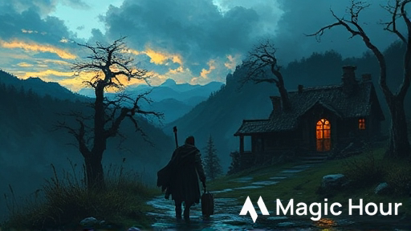
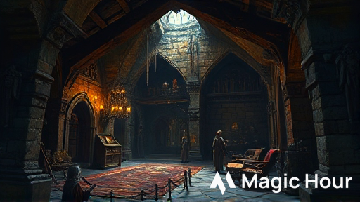
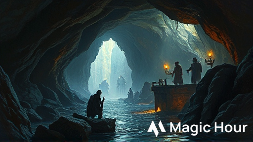
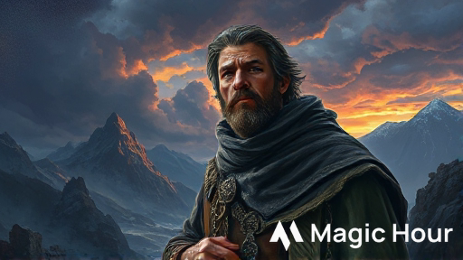
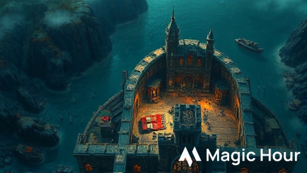

# Le Statue che Camminano
## La Scomparsa di Carp

*Un'avventura D&D 5e per 4 personaggi di livello 1*

**Durata:** 3 ore | **Ambientazione:** Phandalin, Forgotten Realms

{{wide}}

---

> ### 📋 Riepilogo per il DM
> 
> **Fronte**: Kragmaw, un antico Gargoyle Superiore, è stato risvegliato da tombaroli nelle rovine di un tempio nanico. Ha rapito il giovane Carp Dendrar e pianifica di espandere il suo territorio di caccia fino al villaggio, pietrificando gli abitanti per "proteggerli eternamente".
>
> **Passi in Avanti**:
> 1. (24h) Carp viene trasformato in statua. Strani richiami notturni attraggono altri villici verso le rovine.
> 2. (48h) Elsa, guardia notturna, scompare. Gargoyle sorvolano Phandalin studiando le difese. Panico nel villaggio.
> 3. (72h) Attacco coordinato su Phandalin al crepuscolo. 1d4+2 abitanti rapiti. Il villaggio deve essere evacuato.
>
> **I 10 Segreti**:
> 1. Tombaroli hanno risvegliato Kragmaw 2 settimane fa (ora sono statue)
> 2. I gargoyle pietrificano chi resta immobile mentre li osserva (movimento = salvezza)
> 3. Il diario di Carp è nascosto in un albero cavo nel boschetto
> 4. I gargoyle sono vulnerabili in volo e indeboliti dalla luce solare (-2 CA)
> 5. Una preghiera in Nanico sull'altare del tempio addormenta i gargoyle (TS Sag DC 14)
> 6. Carp è ancora salvabile se raggiunto entro 48h dalla scomparsa
> 7. Reidoth il druido vive in una grotta vicina e può fornire pozioni/aiuto
> 8. Il nido dei gargoyle è sul tetto del tempio (attaccabili durante il giorno)
> 9. Sotto l'altare c'è una cripta con tesori: 500 mo, +1 Warhammer, Amuleto Guardian
> 10. Profezia sulle pareti: "chi danza con il vento fermerà il guardiano" (muoversi continuamente)
>
> **Risoluzioni Possibili**:
> - **Combattimento**: Affrontare Kragmaw in battaglia aerea sul tetto del tempio
> - **Negoziazione**: Convincerlo che la sua divinità è morta e farlo tornare in stasi volontariamente (Persuasion DC 18)
> - **Rituale**: Usare la preghiera dell'altare per indurre stasi magica su tutti i gargoyle

\pagebreak

## Background per il DM

Il Tempio della Pietra Vivente fu costruito 300 anni fa dai nani di Phandelver come santuario a Dumathoin, dio nanico della terra e dei segreti sepolti. Quando la miniera di Phandelver cadde, il tempio fu abbandonato e dimenticato.

Kragmaw non è un mostro malvagio per natura: è un guardiano costruito magicamente per proteggere il luogo sacro. Durante i secoli di abbandono, la sua programmazione magica si è corrotta. Ora interpreta "proteggere il tempio" come "trasformare tutti gli intrusi in statue eterne" che diventano parte della "collezione sacra".

Due settimane fa, un gruppo di tombaroli amatoriali ha fatto saltare una parete del tempio cercando oro. L'esplosione ha risvegliato Kragmaw dal suo sonno centenario. Confuso e affamato di essenza vitale, il gargoyle ha immediatamente pietrificato i tombaroli.

Tre giorni fa, il giovane Carp Dendrar - curioso e incosciente come solo un ragazzo di 12 anni può essere - ha esplorato il tempio dopo aver sentito parlare delle "statue che si muovono". È stato catturato da Kragmaw e ora giace semi-pietrificato nelle catacombe, in attesa del destino finale.

Il tempo stringe. I PG devono agire prima che Kragmaw completi la trasformazione di Carp e inizi a cacciare nel villaggio.

---

## Introduzione: Ganci Iniziali

Seleziona uno dei seguenti ganci in base allo stile preferito del gruppo. Tutti conducono alla necessità di investigare le rovine del tempio.

### Gancio A: Il Grido nella Notte (Action)

{{wide}}

> È mezzanotte quando urla disperate squarciano il silenzio di Phandalin. "AIUTO! Le statue! Le maledette statue si muovono!" 
>
> Una figura sanguinante - Elsa, la guardia del turno di notte - corre barcollando verso la locanda, inseguita da ombre alate che proiettano sagome mostruose alla luce della luna. Dal cielo, tre creature di pietra grigia si lanciano in picchiata verso di lei con artigli affilati come rasoi.
>
> Elsa crolla a pochi metri dall'ingresso. Le creature atterrano pesantemente, i loro occhi rossi che vi fissano mentre valutano se siete una minaccia... o un altro bersaglio.

**Per il DM**: Combattimento immediato contro 2 Gargoyle minori (stat ridotti: 30 HP ciascuno). Elsa è a 0 HP, stabile. Se salvata e stabilizzata, racconta di Carp e delle "statue che ti guardano finché non ti muovi più, poi ti saltano addosso".

### Gancio B: La Famiglia Disperata (Mystery)

{{wide}}

> La famiglia Dendrar vi ha convocati alla loro modesta fattoria all'alba. Sul tavolo di legno grezzo, il padre Thel dispone con mani tremanti gli ultimi oggetti del figlio Carp: uno zaino di tela, un quaderno pieno di schizzi infantili di rovine e... qualcosa di strano.
>
> Una piccola statuetta di pietra grigia, pesante e fredda al tatto, che raffigura un ragazzo con gli occhi spalancati dal terrore. "L'abbiamo trovata ieri nel boschetto dove è scomparso," sussurra la madre Qelline con voce rotta. "Non era sua. E guardate bene il volto..."
>
> Il cuore vi si gela: la statuetta ha i lineamenti di Carp. È incredibilmente dettagliata, fin troppo realistica. Come se... Dalla finestra, vedete il boschetto di querce contorte in lontananza. C'è qualcosa che si muove tra gli alberi, una silhouette di pietra che vi osserva immobile.

**Per il DM**: La statuetta è Carp parzialmente trasformato (Arcana DC 12 per identificare magia di trasmutazione). I Dendrar offrono 50 mo, provviste, e gratitudine eterna.

\columnbreak

### Gancio C: L'Incontro al Crepuscolo (Social)

> Al Sleeping Giant Inn, un nano anziano di nome Gundren Rockseeker si avvicina al vostro tavolo con aria grave. "Ho sentito che siete avventurieri esperti. Ho un lavoro... delicato." Ordina un giro di birre e abbassa la voce.
>
> "Tre notti fa, stavo esplorando le vecchie rovine a est per conto della Lionshield. Lì ho visto... cose. Statue che si muovono quando non le guardi. Ho sentito un ragazzo gridare. Volevo andare ad aiutarlo ma... ho avuto paura." La vergogna gli dipinge il volto. "Sono scappato come un codardo. E ora quel ragazzo, Carp, è ancora là fuori."
>
> "Vi pagherò 100 monete d'oro se lo trovate. E se scoprite cosa diavolo sono quelle maledette statue, vi darò queste." Mette sul tavolo due pergamene: *Potion of Healing* e una mappa che mostra un passaggio segreto nelle rovine.

**Per il DM**: Gundren è sinceramente colpevole. Con Persuasion DC 13, può essere convinto ad accompagnare i PG (anche se spaventato). La mappa mostra l'ingresso nascosto dietro il cerchio di pietre.

\pagebreak

## Parte 1: Il Boschetto delle Querce Contorte

{{wide}}

Il primo passo per trovare Carp conduce a un boschetto inquietante a 10 minuti di cammino dal villaggio, dove il ragazzo è stato visto l'ultima volta.

### Arrivo al Boschetto

> Il boschetto delle Querce Contorte merita il suo nome. Gli alberi sono nodosi e distorti, le loro chiome si intrecciano creando un soffitto di foglie che blocca quasi completamente la luce del sole. Le radici sporgono dal terreno come artigli che cercano di afferrarti le caviglie.
>
> Il silenzio è opprimente. Nessun canto di uccelli, nessun fruscio di piccoli animali. Solo il vento che fischia tra i rami spogli. Sul terreno, disseminate come macabri ornamenti, ci sono piccole statue di pietra: conigli, scoiattoli, persino un falco con le ali spiegate, tutti congelati in pose di fuga terrorizzata.
>
> Al centro del boschetto, vedete un cerchio di pietre antiche, mezze sepolte nella terra e coperte di muschio. Le pietre sono incise con simboli nanici che non riuscite a comprendere. E appollaiati su due delle querce più alte, ci sono... statue? Gargoyle decorativi? È difficile dirlo da questa distanza.

### Elementi del Boschetto

**Le Statue di Animali**: Prove di **Intelligence (Arcana) DC 12** rivelano tracce di magia di trasmutazione (petrificazione). Le statue sono recenti - non più di una settimana. Se toccate, sono fredde come pietra ma pesano come se fossero animali veri.

**I Gargoyle Sentinella**: Due Gargoyle minori sono appollaiati sugli alberi, immobili come statue. **Wisdom (Perception) DC 14** per notare che le loro teste seguono leggermente i movimenti dei PG quando non li guardano direttamente.

**Il Cerchio di Pietre**: I simboli sono in Nanico antico. **Intelligence (History) DC 13** o qualcuno che parla Nanico può tradurre: "Qui giace l'ingresso al Santuario di Dumathoin, Custode dei Segreti Sepolti. Solo i devoti possono entrare."

Sotto le radici al centro del cerchio c'è un'apertura nascosta - l'ingresso secondario al tempio. **Wisdom (Perception) DC 14** per notarla.

### Incontro: I Guardiani

Se i PG si avvicinano entro 20 piedi dal cerchio di pietre, i gargoyle si animano e attaccano.

**Tattica**: I gargoyle iniziano con attacchi in picchiata dall'alto (vantaggio al primo attacco se hanno sorpresa). Usano hit-and-run: attaccano, volano via, ripetono. Se un gargoyle scende sotto 15 HP, tenta di fuggire verso il tempio per avvisare Kragmaw.

**Gargoyle Minore** (x2)
- **CA** 15, **HP** 30, **Velocità** 9 m, volo 18 m
- **Attacco**: +4 colpire, 1d6+2 danni taglienti (artigli)
- **Debolezza**: -2 CA alla luce del sole

\columnbreak

### Investigare la Scena

**Il Diario di Carp** (**Investigation DC 12**): Nascosto in un albero cavo vicino al cerchio, i PG trovano il quaderno di Carp. Ultime righe:

> "Le statue nel tempio sono bellissime. Voglio disegnarle tutte! Ma... quando le guardo, sembra che si muovano. No, aspetta. Si muovono DAVVERO quando non guardo! Devo tornare indietro OH DIO MI STA—"

La pagina è strappata. Il resto del diario contiene schizzi della pianta del tempio (utili per orientarsi dopo).

**Tracce di Carp** (**Survival DC 11**): Impronte piccole conducono dal cerchio verso nord-est, dove il terreno sale verso colline rocciose. Macchie di tessuto strappato (dal cappello di Carp) sui rovi.

**Sentiero Secondario** (**Survival DC 13**): Un sentiero appena visibile conduce a ovest, verso una formazione rocciosa. Questo porta alla grotta di Reidoth il druido (Segreto #7).

### Progressione

Da questo punto, i PG possono:
1. Usare l'ingresso nascosto sotto il cerchio (se trovato) → Accesso diretto alle catacombe
2. Seguire le tracce verso nord → Ingresso principale del tempio
3. Seguire il sentiero ovest → Cercare Reidoth per aiuto

\pagebreak

## Parte 2: Il Tempio della Pietra Vivente

{{wide}}

Le rovine del tempio emergono dalle colline rocciose come denti spezzati. Pilastri crollati, muri semi-distrutti, e un tetto parzialmente crollato creano un labirinto di pietra inquietante.

### Ingresso Principale

> Il tempio un tempo era magnifico. Anche ora, rovinato e dimenticato, trasuda un'aura di potere antico. L'ingresso principale è fiancheggiato da due colonne possenti incise con rune nanici e simboli di montagne. Un pesante portone di pietra è aperto a metà, come una bocca spalancata.
>
> Oltre la soglia, l'oscurità. L'odore di pietra umida e aria stagnante vi colpisce. E da qualche parte nel buio, sentite un suono: il lento, ritmico raschiare di pietra contro pietra.

**Sentinella**: Se i PG non hanno neutralizzato i gargoyle del boschetto, ce n'è 1 che sorveglia l'ingresso dall'alto. **Perception DC 13** per notarlo prima che attacchi.

### Piano del Tempio

Il tempio si sviluppa su due livelli:

**Livello Superiore** (accessibile):
- A. Atrio delle Statue
- B. Sala delle Colonne
- C. Sancta Sanctorum (con altare)

**Livello Inferiore** (catacombe, accessibili tramite puzzle):
- D. Camera del Guardiano (Kragmaw e Carp)
- E. Cripta del Tesoro

### A. Atrio delle Statue

> Quattro figure umane vi accolgono nell'atrio, congelate in pose di terrore assoluto. Non sono sculture - sono persone trasformate in pietra. Uno ha le mani protese davanti a sé, come a supplicare pietà. Un altro è caduto in ginocchio, il volto contorto in un grido silenzioso.
>
> Attrezzi da scavo sono sparsi sul pavimento: picconi, corde, lanterne rovesciate. I tombaroli che hanno risvegliato il guardiano hanno pagato il prezzo della loro avidità.

**Per il DM**: Le statue sono i tombaroli pietrificati 2 settimane fa (**Segreto #1**). Se toccate, sono fredde ma hanno ancora vestigia di calore profondo - magia potente le mantiene "vive" ma immobili.

**Investigation DC 12**: I PG trovano tra gli attrezzi:
- 1 Potion of Healing (non bevuta)
- 25 mo sparse
- Nota sgualcita: "L'esplosione dovrebbe aprire il passaggio. Il tesoro deve essere enorme!"

Le statue possono essere animate temporaneamente con l'**Amuleto Guardian** (se trovato nella cripta).

\columnbreak

### B. Sala delle Colonne

> Sei massicce colonne sostengono ciò che resta del soffitto crollato. Su ognuna è scolpito un gargoyle decorativo, ali spiegate e fauci spalancate in un ruggito silenzioso. Raggi di luce filtrano attraverso le crepe, creando pattern danzanti sul pavimento di pietra.
>
> Due delle colonne sembrano... diverse. Le statue su di esse hanno pietra più scura, occhi che brillano debolmente di rosso quando la luce le colpisce. E giurereste di aver visto una di esse sbattere le palpebre.

**I Gargoyle Dormienti**: Due delle sei "statue" sono gargoyle minori addormentati. **Perception DC 14** per identificare quali.

**Stealth DC 14**: I PG possono attraversare silenziosamente senza risvegliarli. Se falliscono, i gargoyle si animano e attaccano dopo 1 round di disorientamento (svantaggio al primo attacco).

**Attacco a Sorpresa**: Se i PG li attaccano mentre dormono, vantaggio automatico agli attacchi.

**La Finestra Crollata**: Sul lato nord, una finestra senza vetri offre vista sul tetto del tempio. **Perception DC 12**: Si vede un nido di rami e pietra sul tetto - il nido dei gargoyle (**Segreto #8**).

### Pareti Incise

Le pareti della sala sono ricoperte di iscrizioni in Nanico.

**Religion o History DC 13**: Traduzione parziale. Racconta la storia di Dumathoin, dio della terra, e dei guardiani di pietra che proteggono i suoi santuari.

**Religion DC 15**: Traduzione completa rivela la profezia (**Segreto #10**):

> "Quando le pietre camminano e i vivi si fermano,  
> solo chi danza con il vento potrà fermare il guardiano eterno.  
> Il movimento è vita, l'immobilità è morte eterna."

Questo è un indizio chiave: **movimento costante** previene la petrificazione di Kragmaw.

\pagebreak

### C. Sancta Sanctorum

> Il cuore del tempio. Una stanza circolare con un soffitto a cupola crollato che lascia entrare la luce della luna/sole. Al centro, un altare massiccio di pietra nera venata d'oro, ancora intatto dopo secoli. Quattro pietre runiche sono disposte attorno all'altare come punti cardinali.
>
> Ogni pietra è grande quanto un pugno e brilla debolmente di luce magica. Simboli elementali sono incisi su ognuna: Terra (nord), Acqua (est), Aria (sud), Fuoco (ovest). Sul frontale dell'altare, una poesia incisa in Nanico e Common.

**La Poesia** (leggibile da tutti):

> "Dalla terra nasce la fonte,  
> dall'acqua vola il respiro,  
> dal respiro cresce la fiamma,  
> dalla fiamma torna la terra."

**Il Puzzle**: Per aprire l'accesso alle catacombe, le pietre devono essere premute nell'ordine del ciclo della creazione nanico: **Terra → Acqua → Aria → Fuoco**.

**Investigation DC 14**: Analizzando la poesia, i PG capiscono l'ordine.

**Fallimento**: Se premute nell'ordine sbagliato, scarica elettrica (2d8 danni fulmine, DC 13 Dex save dimezza). Le pietre si resettano. Il rumore allerta Kragmaw nelle catacombe (emerge in 1d4+2 turni).

**Successo**: L'altare si sposta con un rombo profondo, rivelando scale di pietra che scendono nel buio.

### La Preghiera Nascosta

Sul retro dell'altare, incisa in Nanico piccolo (**Perception DC 15**):

> "Pietra che vive, ritorna al sonno eterno.  
> Guardiano fedele, il tuo servizio è compiuto."

Questa è la **preghiera di stasi** (**Segreto #5**). Se pronunciata ad alta voce entro 60 ft da Kragmaw, lui deve fare **TS Saggezza DC 14** o cadere in animazione sospesa per 24 ore.

**Religion DC 12**: Riconoscere che è una preghiera di dismissione per costrutti sacri.

\columnbreak

### D. Catacombe - Camera del Guardiano

{{wide}}

> Le scale scendono in una camera circolare illuminata da cristalli fosforescenti incastonati nelle pareti. L'aria è fredda e secca, sa di pietra antica e magia potente. Al centro della stanza, su un piedistallo di ossidiana, c'è una figura di pietra alta 2,5 metri.
>
> Kragmaw il Guardiano. Un gargoyle magnifico e terrificante, pietra nera venata d'oro, ali piegate come un mantello regale. I suoi occhi sono chiusi... ma quando entrate, si aprono lentamente, brillando di rosso intenso.
>
> E dietro di lui, visibile attraverso un arco, vedete una piccola figura su un giaciglio di pietra. Carp. Il ragazzo è immobile, pelle che sta diventando grigia come pietra, ma il suo petto si alza e si abbassa - ancora respira!

**Kragmaw si Risveglia**: Quando i PG entrano, Kragmaw si anima lentamente. Prima di attaccare, parla in Terran (o telepaticamente):

> "Profanatori. Venite a rubare i segreti del Custode delle Pietre? No. Diventerete parte della collezione eterna. Guardiani perfetti. Silenti. Eterni."

Qui i PG possono:
1. **Attaccare immediatamente** → Combattimento (vedi Parte 3)
2. **Tentare Negoziazione** → Persuasion DC 18 (facilitato da Segreti #5, #10, presenza Reidoth)
3. **Pronunciare Preghiera** → Se conoscono Segreto #5, tentano rituale di stasi
4. **Distrarre e Salvare Carp** → Alcuni combattono, uno corre a Carp

**Timer**: Carp può sopravvivere altri 1d4 ore prima di completare trasformazione. Se combattimento supera 10 round, Carp è in pericolo.

### E. Cripta del Tesoro

Sotto l'altare del Sancta (se aperto con puzzle), c'è una piccola cripta.

**Tesoro** (**Segreto #9**):
- 500 mo in gemme e monete antiche
- **Earthshatter** (+1 Warhammer, vedi Appendice)
- **Amuleto del Guardian** (danneggiato, vedi Appendice)
- 3x Potion of Healing
- Atto di proprietà del tempio (documento storico, valore 50 mo per collezionisti)

\pagebreak

## Parte 3: Il Confronto Finale

{{wide}}

Il climax dell'avventura avviene quando i PG affrontano Kragmaw. Ci sono tre modi principali per risolvere la minaccia, ognuno con rischi e ricompense diverse.

### Opzione 1: Combattimento Diretto

Kragmaw combatte per proteggere "il suo" tempio. È un avversario formidabile per PG di livello 1, ma non invincibile.

**Arena**: La battaglia può avvenire nella Camera del Guardiano (sotterranea, claustrofobica) o sul Tetto del Tempio (se Kragmaw fugge lì - più spazio, hazard ambientali).

#### Kragmaw il Guardiano Antico
*Costrutto Medio (gargoyle superiore), legale neutrale*

___
**Classe Armatura** 15 (pietra naturale)  
**Punti Ferita** 52 (7d8 + 21)  
**Velocità** 9 m, volo 18 m

___

|FOR|DES|COS|INT|SAG|CAR|
|:---:|:---:|:---:|:---:|:---:|:---:|
|15 (+2)|11 (+0)|16 (+3)|8 (-1)|11 (+0)|7 (-2)|

___

**Resistenze ai Danni** Contundente, perforante, tagliente non magico  
**Immunità ai Danni** Veleno  
**Immunità alle Condizioni** Affaticato, Avvelenato, Pietrificato  
**Sensi** Scurovisione 18 m, Percezione passiva 10  
**Linguaggi** Terran, telepatia 30 ft  
**Grado di Sfida** 2 (450 XP)

___

***Falsa Apparenza.*** Mentre Kragmaw rimane immobile, è indistinguibile da una statua inanimata.

***Sguardo Pietrificante (Ricarica 5-6).*** Kragmaw fissa una creatura entro 30 ft che può vedere. Se la creatura non si è mossa nel suo ultimo turno, deve superare un **TS Costituzione CD 12** o iniziare a pietrificarsi. Creatura Trattenuta, deve ripetere save a fine ogni suo turno. 3 fallimenti = pietrificazione completa, 3 successi = effetto termina.

***Vulnerabilità alla Luce.*** Alla luce solare diretta, Kragmaw ha **svantaggio ai tiri per colpire** e **-2 alla CA**.

### Azioni

***Multiattacco.*** Kragmaw effettua due attacchi con gli artigli.

***Artigli.*** *Attacco con Arma da Mischia:* +4 al colpire, portata 1,5 m, un bersaglio. *Colpo:* 5 (1d6 + 2) danni taglienti.

***Morso.*** *Attacco con Arma da Mischia:* +4 al colpire, portata 1,5 m, un bersaglio. *Colpo:* 7 (1d10 + 2) danni perforanti.

\columnbreak

#### Tattica di Kragmaw

**Fase 1 - Test (Round 1-2, HP pieno)**:
- Vola alto (60 ft) valutando i PG
- Usa Sguardo Pietrificante su caster/guaritori
- Attacchi in picchiata: scende, colpisce, risale

**Fase 2 - Aggressivo (Round 3-5, HP 52-25)**:
- Atterra per usare Multiattacco efficacemente
- Focus su PG isolati o feriti
- Se Carp è in pericolo, tenta di "proteggerlo"

**Fase 3 - Disperato (Round 6+, HP sotto 20)**:
- Afferra Carp e cerca di fuggire
- Se bloccato, combatte recklessly (bonus +2 danni, -2 CA)
- A 0 HP, si disintegra in polvere lasciando gemma magica

#### Hazard Ambientali (Se sul Tetto)

**Piattaforme Instabili**: DC 12 Acrobatics o si cade 20 ft (2d6 danno)

**Colonne Crollate**: Copertura parziale (+2 CA)

**Nido dei Gargoyle**: Se distrutto, Kragmaw diventa enfuriato (+2 danni, attacca recklessly)

### Opzione 2: Negoziazione

Kragmaw non è malvagio - è un guardiano corrotto. Può essere ragionato.

**Requisiti Base**:
- Non aver distrutto statue/profanato il tempio
- Dimostrare conoscenza della storia del tempio (Religion/History DC 15)
- Persuasion DC 18 per convincerlo

**Bonus Situazionali**:
- Presenza di Reidoth: +5 al check (testimone credibile)
- Conoscenza Segreto #5 (preghiera): +2
- Conoscenza Segreto #10 (profezia): +2
- Parlare in Terran: +2

**Argomenti Chiave**:
1. "Dumathoin è silente da 200 anni. Il tempio è stato abbandonato."
2. "Non siamo profanatori. Veniamo per salvare un innocente."
3. "Torna in stasi. Proteggeremo il tempio finché la tua divinità non tornerà."

**Successo**: Kragmaw accetta. Rilascia Carp, torna sul piedistallo, si pietrifica volontariamente. Può essere "risvegliato" in futuro come alleato se i PG mantengono la promessa.

**Fallimento (per 5 o meno)**: Kragmaw chiede una "prova di valore" (combattimento non letale, puzzle, o giuramento magico). Se superano, accetta.

**Fallimento Critico**: "MENTITORI!" Combattimento inizia immediatamente.

\pagebreak

### Opzione 3: Rituale di Stasi

Usare il **Segreto #5** per indurre magicamente Kragmaw in animazione sospesa.

**Piano**:
1. Attirare Kragmaw nel Sancta Sanctorum (raggio 60 ft dall'altare)
2. Pronunciare la preghiera in Nanico (1 azione completa)
3. Kragmaw fa **TS Saggezza DC 14** o cade in stasi

**Complicazioni**:
- Kragmaw cercherà di interrompere il PG che pronuncia
- Se il PG subisce danno durante pronuncia: Concentration check DC 10 + danno
- Altri PG devono distrarre/bloccare Kragmaw

**Check**: Performance o Religion DC 12 per pronunciare correttamente
- **Successo**: Kragmaw fa il TS
- **Fallimento**: Pronuncia errata, scarica elettrica (2d8 fulmine)

**Stasi Permanente** (Opzionale): Usando la gemma del tesoro (Segreto #9) come focus durante pronuncia, Arcana DC 16 rende la stasi permanente.

---

## Epilogo: Eroi di Phandalin

{{wide}}

### Salvare Carp

Se i PG sconfiggono/neutralizzano Kragmaw entro 48 ore dalla scomparsa, Carp torna automaticamente umano in 1d4 ore. È spaventato ma illeso.

Se oltre 48 ore, serve *Lesser Restoration* o *Greater Restoration* (Reidoth può lanciare Lesser se convinto).

### Ricompense

**Dalla Famiglia Dendrar**:
- 50 mo promessi
- Ospitalità permanente (cibo e riposo gratis alla fattoria)
- Carp come contatto futuro (info/messaggero)

**Dal Villaggio** (se donano parte tesoro o salvano anche Elsa):
- 150 mo dalla colletta cittadina
- Titolo di "Salvatori di Phandalin"
- Sconto 10% da mercanti
- Villa gratuita per soste future

**Ricompense Narrative**:
- Reputazione: bardi cantano le gesta dei PG
- Agganci futuri: Townmaster li consulta per minacce
- Se alleanza con Kragmaw: guardian permanente del tempio

\columnbreak

### Conseguenze Future

**Se Kragmaw è Morto**:
- Tempio è sicuro ma vuoto
- Potrebbe attirare altri tombaroli
- Spirito di Dumathoin è silente

**Se Kragmaw è in Stasi Temporanea**:
- Si risveglierà dopo 24h
- PG devono sigillare ingresso o tornare
- Può diventare problema ricorrente

**Se Kragmaw è Alleato**:
- Protegge il tempio volontariamente
- PG possono "richiamarlo" una volta per campagna
- Diventa protettore segreto di Phandalin

**Se Elsa è Stata Rapita (Passo 2)**:
- Pressione narrativa aumentata
- Possibilità di salvare entrambi
- Ricompensa doppia dal villaggio

### Agganci per Avventure Future

1. **Gli Altri Tombaroli**: I compagni dei tombaroli pietrificati cercano vendetta o vogliono il tesoro
2. **Il Culto di Dumathoin**: Sacerdoti nani sentono del risveglio del tempio e vengono a investigare
3. **I Gargoyle Superstiti**: Se alcuni gargoyle minori sono fuggiti, potrebbero stabilirsi altrove
4. **Il Segreto della Cripta**: L'atto di proprietà menziona altre camere sigillate nel tempio
5. **Reidoth's Quest**: Il druido chiede ai PG di aiutarlo con una minaccia druidica

---

## Appendice A: PNG Dettagliati

{{wide}}

### Carp Dendrar

Ragazzo umano di 12 anni, capelli rossi ribelli, lentiggini. Indossa sempre un cappello di paglia troppo grande. È curioso, coraggioso, e parla velocissimo quando eccitato.

**Ruolo**: Vittima da salvare. Se liberato, diventa alleato fidato e fonte di informazioni sul villaggio. Sogna di diventare avventuriero.

**Dopo l'Avventura**: Può fornire ai PG:
- Gossip del villaggio (advantage su Charisma checks per info)
- Servizio da messaggero discreto
- Schizzi e mappe (ha buona memoria visiva)

\pagebreak

### Reidoth "Pietra Muschiata"

Umano anziano (65 anni), druido eremita. Barba lunga intrecciata con foglie, tuniche di corteccia. Occhi grigi come pietra. Si muove lentamente, appoggiato a un bastone nodoso che germoglia fiori.

**Motivazione**: Vive in eremitaggio dopo aver perso il suo circle druidico 20 anni fa. Conosce la storia del tempio (suo nonno era un sacerdote nanico). Vuole fermare Kragmaw prima che corrompa la natura circostante.

**Come Trovarlo**: La sua grotta è a ovest del boschetto. Tracce di druido visibili con Survival DC 13.

**Come Convincerlo** (scegli uno):
- Persuasion DC 13: "Un ragazzo è in pericolo!"
- Mostrare diario di Carp (auto-successo emotivo)
- Intimidation DC 15: "Aiuta o il villaggio sarà distrutto!"

**Aiuto Fornito**:
- Traduzione preghiera/profezia (Segreti #5, #10)
- 2x Potion of Lesser Restoration (cura petrificazione parziale)
- 6x Goodberry
- Conoscenza su gargoyle (+2 primi attacchi)
- Può accompagnare come NPC alleato

**Stats** (se combatte): Druido livello 5, focus su support. *Cure Wounds*, *Entangle*, *Barkskin*, *Call Lightning*.

---

## Appendice B: Oggetti Magici

{{wide}}

### Earthshatter, Martello del Tempio
*Arma da guerra (+1 Warhammer), non comune (richiede sintonia)*

Martello da guerra nanico in acciaio argentato con rune di pietra incise. Manico avvolto in cuoio roccioso. Emette suono profondo come tuono quando colpisce.

**Proprietà**:
- +1 ai tiri per colpire e danni
- Una volta al giorno, azione bonus: lancia *Shatter* (CD 13) centrato sul punto di impatto
- Brilla di luce fioca (30 ft) in presenza di costrutti/creature di pietra

**Storia**: Forgiato 300 anni fa dal mastro fabbro Thoradin Earthbreaker per i guardiani del tempio. Sopravvissuto all'abbandono grazie a preservazione magica.

\columnbreak

### Amuleto del Guardian (Danneggiato)
*Oggetto meraviglioso, raro*

Medaglione di pietra nera a forma di scudo, incrinato in più punti. Vene di oro magico lo tengono insieme. Emette debole pulso magico ogni 6 secondi.

**Proprietà** (versione danneggiata):
- Azione standard: anima una statua pietrificata entro 30 ft per 1 ora
- Statua ha stats di **Animated Armor** (MM p.19), ma pietra (resistenza contundente/perforante)
- **3 cariche totali** prima di disintegrarsi

**Uso Tattico**: Ottimo per animare le statue dei tombaroli nell'atrio come alleati temporanei. Strategicamente prezioso per PG livello 1-3.

**Potenziale Futuro**: Può essere riparato da artefice esperto (quest hook in città più grande). Versione riparata: 5 cariche, ricarica 1d4+1 all'alba.

---

## Appendice C: Hazard e Trappole

### Lo Sguardo Pietrificante (Hazard)

**Trigger**: Restare immobili per 1 turno completo mentre un gargoyle ti osserva direttamente (entro 30 ft, linea di vista chiara)

**Effetto**: TS Costituzione CD 12
- **Fallimento**: Inizi a pietrificarti. Condizione *Restraained*. Ripeti save a fine ogni tuo turno: 3 fallimenti = pietrificazione completa (incapacitato, AC 9, resistenza a tutto danno, HP invariati). 3 successi = effetto termina.
- **Successo**: Resisti, ma se resti immobile di nuovo, ripeti TS

**Contromisure**:
- Movimento costante (almeno 5 ft per turno) = immune
- Spezzare linea di vista (cover, oscurità) = immune
- *Lesser Restoration* cura petrificazione parziale
- *Greater Restoration* o distruzione del gargoyle cura petrificazione completa

### Piattaforme Instabili del Tetto

**Descrizione**: Sezioni del tetto del tempio sono pericolamente instabili dopo secoli di degrado.

**Identificazione**: Perception o Investigation DC 12 prima di salire

**Effetto**: Quando creatura di peso >75 kg si muove su piattaforma instabile, 50% chance crollo
- Creatura sulla piattaforma: cade 20 ft (2d6 danno), DC 13 Dex save dimezza e atterra in piedi
- Creature sotto: DC 12 Dex save o 1d6 danno da detriti

**Uso Tattico**: PG possono shove Kragmaw su piattaforme deboli per innescare crollo intenzionale

\pagebreak

## Appendice D: Aiuti per il DM

### Scalabilità

**Per 3 PG o giocatori meno esperti**:
- Riduci gargoyle minori da 2 a 1 in ogni incontro
- HP di Kragmaw: 40 invece di 52
- Ricarica Sguardo Pietrificante: 6 invece di 5-6

**Per 5-6 PG**:
- Aggiungi +1 gargoyle minore in ogni incontro
- HP di Kragmaw: 60 invece di 52
- Kragmaw ha +1 alla CA (16)

**Per PG livello 2**:
- Usa stat block Gargoyle completo (MM, 52 HP)
- Aggiungi 1d4 gargoyle minori extra nel tempio
- Kragmaw ha reaction: *Stone Skin* (+2 AC fino a inizio prossimo turno, 3/giorno)

### Gestire il Timer

Il "conto alla rovescia" di 48 ore serve a creare urgenza, NON a punire i PG.

**Indicatori Narrativi**:
- Dopo 12 ore: Familiari di Carp sempre più disperati
- Dopo 24 ore: Altri villici vedono gargoyle sorvolare di notte
- Dopo 36 ore: Elsa (guardia) sparisce (Passo 2 attivato)
- Dopo 48 ore: Carp completamente pietrificato (serve magia)

**Flessibilità**: Se i PG si stanno divertendo esplorando, non affrettare eccessivamente. Il timer è una guida, non una punizione.

### Atmosfera e Descrizioni

**Temi Chiave**:
- **Silenzio Opprimente**: Sottolinea l'assenza di suoni naturali
- **Movimento Periferico**: Ombre che si muovono quando non guardano
- **Pietra Vivente vs Morte**: Contrasto tra movimento fluido dei gargoyle e rigidità delle statue
- **Horror Gotico**: Ispirazione da Weeping Angels (Doctor Who) - non guardarli

**Descrizioni Sensoriali Efficaci**:
- **Vista**: Occhi rossi che brillano nel buio, pietra che si screpola, vene d'oro magiche
- **Udito**: Pietra che raschia, ali che battono pesantemente, respiro gorgogliante di Kragmaw
- **Tatto**: Freddo innaturale delle statue, vibrazione magica nell'aria
- **Olfatto**: Pietra umida, aria stagnante, odore di ozono (magia)

\columnbreak

### Risoluzione Pacifica: Dettagli

Se i PG riescono a negoziare con Kragmaw, questa è una risoluzione narrativamente ricca:

**Dialogo di Kragmaw** (se convince):

> "Vedo... verità nelle vostre parole. La voce del Custode è silenziosa da... troppo tempo. Ho fallito. Ho protetto un santuario vuoto con metodi di morte."
>
> *Kragmaw guarda Carp con qualcosa simile a rimorso*
>
> "Il piccolo... non voleva profanare. Voleva solo... imparare. Come un giovane accolito. Perdonami, guardiano minore."
>
> *Si volta verso i PG*
>
> "Se giurate sul nome del Custode delle Pietre di proteggere questo luogo sacro fino al ritorno della voce divina, io... tornerò al sonno eterno. E il piccolo tornerà alla sua forma mortale."

**Giuramento Magico**: I PG devono toccare l'altare e pronunciare: "Giuro sul Custode delle Pietre di proteggere questo santuario."

Non ha conseguenze meccaniche vincolanti (non è *Geas*), ma crea engagement narrativo. Se i PG tradiscono promessa in campagne future, Kragmaw potrebbe risvegliarsi ostile.

### Combattimento Tattico: Consigli

**Per i PG**:
- **Focus Fire**: Abbattere gargoyle minori prima di Kragmaw
- **Movimento Costante**: Mai stare fermi più di 1 turno
- **Sfruttare Ambiente**: Cover, piattaforme instabili, luce solare
- **Coordinazione**: Un PG distrae mentre altro salva Carp
- **Oggetti**: Usare pozioni di Reidoth/tesoro strategicamente

**Per il DM (Kragmaw)**:
- **Non Stupido**: Kragmaw è intelligente, usa tattica
- **Target Priority**: Caster/guaritori > marziali
- **Ritirata Tattica**: Se ferito gravemente, può fuggire per prepararsi
- **Non Sadico**: Vuole "proteggere/preservare", non torturare
- **Morale Check**: A 20 HP, considera fuga o trattativa

---

**FINE DOCUMENTO**

*Avventura generata con D&D Adventure Generator - Sistema a 4 Blocchi*

