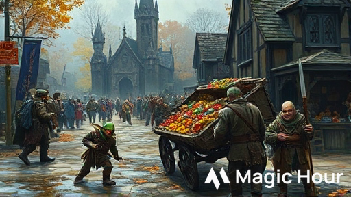
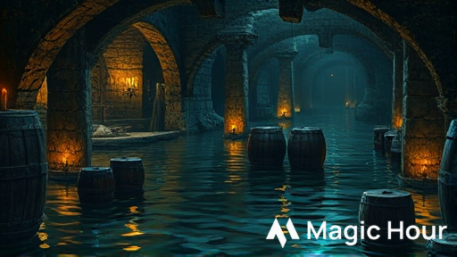
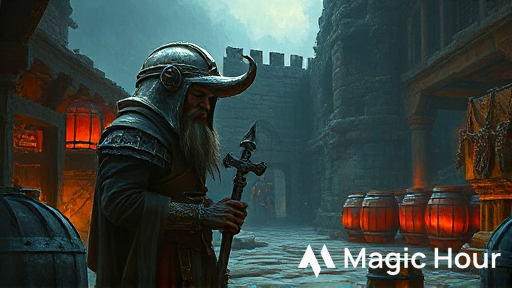

{{margin-top:25px}}

# La Festa del Raccolto Maledetto

*Un'avventura D&D 5e per 5 personaggi di livello 1*

**Durata:** 3-4 ore | **Ambientazione:** Phandalin, Costa della Spada (Forgotten Realms)

{{imageMaskEdge1,--offsetX:0%,--offsetY:0%
  {width:350px}
}}
___

> ##### 📋 Riepilogo per il DM
> **Fronte:** Snik Orecchiatagliata, un goblin astuto, ha scoperto antiche rovine naniche sotto le Colline del Triboar. Ha trovato barili di idromele magico che conferisce forza ai suoi seguaci, e ora sta rubando provviste per formare una nuova tribù.
> 
> **Passi in Avanti (se i PG non intervengono):**
> 1. I goblin rubano cibo dalle fattorie, rendendo impossibile la Festa del Raccolto
> 2. Snik recluta bugbear e altri goblin, attaccando le carovane sulla Strada del Triboar
> 3. I goblin assaltano Phandalin di notte, saccheggiando il villaggio
> 
> **I 10 Segreti:**
> 1. Le impronte a tre dita sono di goblin che trascinano barili pesanti
> 2. L'idromele magico nano conferisce +2 FOR per 1 ora ma causa dipendenza
> 3. Snik era uno schiavo hobgoblin e ha imparato a leggere il nanico
> 4. L'ingresso alle rovine si trova nella cantina crollata della Fattoria Alderleaf
> 5. I goblin temono i lupi; Carp Alderleaf sa imitare il loro verso
> 6. Un barile integro di idromele vale 200 mo ma può esplodere se agitato
> 7. Le rovine erano l'avamposto commerciale Karak-Thûn, abbandonato 400 anni fa
> 8. Snik ha una mappa con altre 2 entrate: una grotta e il vecchio mulino
> 9. Sildar Hallwinter pagherà 50 mo per info, 100 mo per sconfiggere i goblin
> 10. Tra i tesori c'è un martello cerimoniale della famiglia Alderleaf
> 
> **Risoluzioni Possibili:**
> - **Combattimento:** Confronto diretto con Snik nelle rovine
> - **Sociale:** Negoziare con Snik o ingannarlo (idromele "maledetto")
> - **Astuzia:** Usare ululati di lupo per far fuggire i goblin nel panico, o sabotare l'idromele

___

\columnbreak

## Background

Phandalin si prepara alla sua Festa del Raccolto annuale, un evento che celebra la prosperità e l'unità della comunità. Quest'anno, però, strani furti notturni hanno messo a rischio i festeggiamenti. Dispense svuotate, pollai saccheggiati, e persino interi carri di provviste spariti nel nulla.

La verità è inquietante: un gruppo di goblin guidato dall'astuto Snik Orecchiatagliata ha scoperto le antiche rovine dell'avamposto nanico di Karak-Thûn, sepolte sotto le colline. Nelle profondità, Snik ha trovato barili di idromele magico che conferisce forza sovrumana. Ora sogna di usare questa scoperta per diventare il capo di una nuova tribù goblin nella regione.

I personaggi, che si trovano a Phandalin per aiutare con i preparativi della festa, vengono coinvolti quando il furto più audace avviene in pieno giorno.

## Introduzione

### Scegli un Gancio

Seleziona uno dei seguenti ganci in base allo stile di gioco preferito dal gruppo:

**Gancio A: Furto in Pieno Giorno (Action)**

> Siete nella piazza del mercato di Phandalin, aiutando a scaricare zucche e grano dalla Locanda Pietrafinestra, quando urla si levano dalla fontana centrale. Un carro carico di provviste è stato rovesciato! Piccole figure incappucciate - non più alte di un metro - stanno afferrando sacchi di cibo e fuggendo verso il bosco a est. Gli abitanti urlano e gesticolano, ma nessuno sembra avere il coraggio di inseguirli.

**Gancio B: Il Mistero dei Furti (Mystery)**

> Elsa Grano d'Oro, l'anziana organizzatrice della festa, vi ferma con aria afflitta. "Per favore, cari, dovete aiutarmi!" dice gesticolando nervosamente. "Nelle ultime tre notti, qualcuno ha rubato le provviste di mezza Phandalin. Dispense, pollai, persino la cantina di Toblen! Non ci sono segni di effrazione, solo uno strano odore acre e piccole impronte a tre dita. Senza quel cibo, la Festa del Raccolto è rovinata!"

**Gancio C: Tensioni in Crescita (Social)**

> L'assemblea cittadina nella piazza si sta trasformando in una rissa. "Tu hai rubato le mie patate!" urla il fattore Daran Edermath a Qelline Alderleaf. "E tu la mia birra!" replica lei. Toblen Pietrafinestra cerca di mediare ma viene ignorato. Il locandiere vi fa cenno disperato: "Dovete scoprire chi è il vero ladro, prima che questa comunità si distrugga dall'interno!"

\pagebreak

## Parte 1: Investigazioni a Phandalin

Una volta scelto il gancio, i personaggi possono investigare in città. I seguenti PNG possono fornire informazioni:

### PNG Importanti

#### Elsa Grano d'Oro
*Umana, organizzatrice della festa*

**_Aspetto._** Donna sulla sessantina con capelli grigi raccolti e grembiule sempre cosparso di farina. Parla velocissimo gesticolando molto.

**_Personalità._** Energica ma ansiosa, chiama tutti "tesoro" o "caro". Questo anno la festa è particolarmente importante per lei: vuole onorare la memoria del marito, morto l'anno scorso.

**_Informazioni._** Elsa può dire ai PG:
- I furti sono iniziati tre notti fa
- Hanno colpito almeno 7 case e la locanda
- Nessuno ha visto i ladri, solo sentito rumori di notte
- Qelline Alderleaf è stata colpita due volte

**_Ricompensa._** Offre 50 mo dal fondo della festa se i PG risolvono il problema.

#### Sildar Hallwinter
*Umano, membro dell'Alleanza dei Lord*

**_Aspetto._** Guerriero umano di mezza età in armatura di maglia, sempre composto e professionale.

**_Informazioni._** Sildar è preoccupato che i furti siano segno di una minaccia più grande. Offre 50 mo per informazioni concrete sui responsabili e 100 mo se vengono eliminati.

#### Qelline Alderleaf
*Halfling, fattrice*

**_Aspetto._** Halfling robusta con aria pratica e mani callose dal lavoro nei campi.

**_Personalità._** Protettiva verso suo figlio Carp, pragmatica ma gentile.

**_Informazioni._** Se i PG la rassicurano (Persuasion DC 12), Qelline rivela:
- Suo figlio Carp ha visto "piccoli mostri verdi" nei boschi
- Ha notato strani rumori dalla vecchia cantina crollata nella sua fattoria
- I suoi polli sono terrorizzati ogni notte

\columnbreak

### Tracce e Indizi

I personaggi possono investigare le scene dei furti. Con una prova di **Survival DC 12**, scoprono:
- Piccole impronte a tre dita (goblin)
- Segni di trascinamento di oggetti pesanti verso est
- Un odore acre caratteristico (i goblin)
- Le tracce portano verso le colline oltre la Fattoria Alderleaf

Con **Investigation DC 13** nelle location colpite:
- I ladri hanno preso solo cibo, non oggetti di valore
- Sono entrati da finestre o porte sul retro
- Hanno agito con una certa organizzazione

### Carp Alderleaf
Se i PG parlano con Carp (il figlio 10enne di Qelline), il ragazzo è entusiasta di aiutare:
- Ha visto 4-5 goblin uscire dalla vecchia cantina crollata
- Possono entrare nella fattoria la notte quando i goblin tornano
- Carp sa imitare perfettamente l'ululato del lupo (informazione utile!)

## Parte 2: Gli Scenari

La struttura dell'avventura è a **hub**: Phandalin è la base centrale da cui i PG possono esplorare i tre scenari in qualsiasi ordine. Ogni scenario rivela segreti e si avvicina al confronto finale.

___

> ##### Nota per il DM
> I giocatori possono affrontare questi scenari in qualsiasi sequenza. Ogni scenario fornisce indizi e segreti che aiutano a risolvere gli altri. Non forzare un ordine specifico.

___

\pagebreak

# Scenario A: La Fattoria Alderleaf

*Questo scenario può iniziare in due modi: i PG decidono di investigare la fattoria, oppure vengono chiamati per difenderla da un attacco notturno.*

> Seguite il sentiero tortuoso che porta alla fattoria degli Alderleaf, circondata da campi dorati di grano maturo. La casa di legno con il tetto di paglia sembra tranquilla, ma notate che le imposte sono tutte chiuse nonostante sia giorno. Nel cortile, alcune galline razzolano nervosamente, e un cane abbaia sporadicamente verso est, in direzione del vecchio fienile mezzo crollato.

### Per il DM

**_Atmosfera._** La fattoria è tesa. Qelline è nervosa e tiene Carp in casa. Gli animali sono agitati.

**_Elementi Interattivi:_**
- Il cane (Thieving) abbaia verso la vecchia cantina crollata dietro il fienile
- I polli hanno perso metà piume per lo stress
- La cantina crollata è parzialmente coperta da tavole e detriti
- Nel fienile ci sono attrezzi che potrebbero essere utili (corde, lanterne, pale)

**_Segreti Scopribili:_** #1, #4, #5, #10

### Evento: L'Attacco Notturno (Opzionale)

Se i PG decidono di rimanere la notte per tendere un'imboscata:

> La notte è calda e senza luna. Verso mezzanotte, sentite movimenti furtivi vicino al pollaio. Quattro figure basse e goffe emergono dall'ombra del fienile, con sacchi di juta nelle mani. Uno di loro spalanca la porta del pollaio con un calcio.

**Incontro:** 4 **goblin** (vedi Appendice per statistiche)

**_Tattica._** I goblin cercano di rubare galline e sacchi di grano. Se sorpresi, due combattono mentre gli altri due fuggono. Se ridotti a metà, tutti fuggono verso la cantina crollata.

**_Successo._** Se i PG catturano almeno un goblin, possono interrogarlo (vedi Prove di Abilità sotto).

**_Fallimento._** Se i goblin fuggono, lasciano comunque tracce chiare verso la cantina.

\columnbreak

### Prove di Abilità

#### Inseguire i Goblin (Fisica)
**Athletics o Acrobatics DC 13**

**_Successo._** I PG raggiungono i goblin prima che raggiungano la cantina. Possono affrontarli o seguirli fino all'ingresso segreto. **Segreti rivelati: #1 (impronte con segni di barili), #4 (ingresso nascosto)**

**_Fallimento (Fail Forward)._** I goblin scompaiono tra le macerie, ma lasciano cadere un sacco di grano rubato. Le tracce sono chiare fino alla cantina crollata. I PG possono seguirle al mattino, ma i goblin dentro sono ora in allerta e hanno preparato un'imboscata (le guardie goblin hanno vantaggio su Perception). **Segreto #1 rivelato**

#### Parlare con Qelline e Carp (Sociale)
**Persuasion o Insight DC 12**

**_Successo._** Qelline, rassicurata, ammette che Carp ha visto i goblin più volte. Carp li porta entusiasta alla cantina crollata e dimostra la sua abilità di imitare l'ululato del lupo (un talento locale). "I mostri ne hanno paura!" esclama. **Segreti rivelati: #4 (ingresso), #5 (goblin temono lupi, Carp sa imitarli)**

**_Fallimento (Fail Forward)._** Qelline è troppo spaventata per parlare e vieta a Carp di uscire. Tuttavia, Carp scappa dalla finestra quella notte per "aiutare gli eroi" e guida i PG alla cantina, ma ora è in pericolo e dovrete proteggerlo durante l'esplorazione. **Segreto #4 rivelato, ma complicazione**

#### Esplorare la Cantina Crollata (Investigazione)
**Investigation o Perception DC 13**

**_Successo._** Rimuovendo le macerie, scoprite una scala di pietra che scende nelle tenebre. L'odore acre è forte. Sulla parete vedete antiche rune naniche quasi cancellate. Impronte goblin fresche vanno e vengono. Se proseguite, questo porta alle Rovine di Karak-Thûn (Scenario B). **Segreto #4 rivelato**

**_Fallimento (Fail Forward)._** Rimuovere le macerie fa molto rumore. I goblin sotto terra sono allertati e preparano un'imboscata. Quando i PG scendono, vengono accolti da 3 goblin armati (incontro più difficile). **Segreto #4 parziale**

### Collegamenti
- **Rovine di Karak-Thûn:** L'ingresso nella cantina porta direttamente alle rovine (Scenario B)
- **Villaggio:** I PG possono tornare a riferire o cercare rinforzi

\pagebreak

# Scenario B: Le Rovine di Karak-Thûn

*L'antico avamposto commerciale nanico, ora nascondiglio dei goblin*

> Scendete le scale di pietra consumata dal tempo. L'aria diventa fredda e umida. Dopo una ventina di gradini, emergete in un corridoio largo circa tre metri, con soffitto a volta sostenuto da pilastri squadrati. L'acqua gocciola dalle pareti, e un rigagnolo scorre al centro del pavimento. Sulla parete destra, rune naniche sono ancora visibili, anche se coperte di muschio. L'odore di goblin è forte qui.

### Per il DM

**_Layout Generale._** Le rovine consistono in:
1. **Corridoio d'Ingresso:** Lungo 15 metri, con rune naniche
2. **Antica Cantina (Allagata):** Camera principale, 10x10 metri, acqua alta 60 cm
3. **Camera del Consiglio:** Sala finale dove si trova Snik
4. **Celle di Stoccaggio:** Laterali, usate come dormitori goblin

**_Atmosfera._** Umido, buio, echi d'acqua che gocciola. Rune che brillano debolmente se illuminate. Senso di antica gloria decaduta.

**_Elementi Interattivi:_**
- Le rune naniche raccontano la storia dell'avamposto
- Barili antichi parzialmente sommersi nell'acqua
- Pilastri instabili (potrebbero crollare)
- Passaggi stretti che i PG possono usare tatticamente

**_Segreti Scopribili:_** #2, #3, #6, #7

### Mappa delle Rovine

{{descriptive
```
    [Ingresso Fattoria Alderleaf]
                |
    +-----------+-----------+
    |   Corridoio Rune     |
    +----------+-----------+
               |
+------+-------+------+------+
|Cella |  Cantina    |Cella |
|Ovest | (allagata)  | Est  |
+------+      |      +------+
              |
       +------+------+
       | Camera del |
       |  Consiglio |
       +------------+
```
}}

\columnbreak

### 1. Corridoio d'Ingresso

> Il corridoio si estende davanti a voi, le pareti decorate con rune naniche elaborate. Scorgete simboli di martelli, anvils e montagne. L'acqua scorre in una canaletta al centro, sparendo in un buco nel pavimento.

**_Prova:_** Decifrare le rune (History o Investigation DC 15)

**_Successo._** Le rune dicono: "Karak-Thûn, avamposto del Clan Thundil. Qui riposiamo e commerciamo. L'idromele della forza montana ci sostiene." Data: circa 400 anni fa. **Segreto #7 rivelato**

**_Fallimento._** Capite solo che questo era un luogo nanico importante. Toccando le rune attivate accidentalmente un'antica trappola magica: un suono acuto echeggia in tutte le rovine, allertando tutti i goblin. **Segreto #7 parziale**

### 2. Cantina Allagata

{{wide

}}

> Entrate in una grande camera con soffitto a volta. L'acqua copre il pavimento per circa 60 centimetri, riflettendo la luce della vostra torcia come uno specchio scuro. Lungo le pareti, file di barili di legno emergono dall'acqua. Alcuni sono crollati e marciscono, altri sembrano intatti. Scorgete movimento nell'angolo più lontano: piccole figure goffe e qualcosa che guizza nell'acqua.

**_Minacce._** 
- 2 **goblin** ubriachi di idromele (hanno +2 FOR, -2 WIS, sono vocali e aggressivi)
- 1 **sciame di ratti** (attirati dal cibo rubato)

**_Difficile Terrain._** L'acqua alta rende tutto il movimento a metà velocità.

**_Tesoro._** Tra i barili:
- 3 barili di idromele magico intatti (uno contiene 10 dosi)
- 1 barile parzialmente svuotato (2 dosi rimaste)
- Provviste rubate: sacchi di grano, prosciutti, formaggi (valore 50 mo)

### Prove di Abilità

#### Navigare la Cantina (Esplorazione)
**Athletics o Perception DC 14**

**_Successo._** Trovate un sentiero di pietre sommerse che permette di attraversare senza fare rumore. Raggiungete i barili senza allertare i goblin e i ratti. Esaminando i barili, ne identificate uno intatto con rune naniche: "Forza dei Montanari - maneggiare con cura". **Segreti rivelati: #2 (effetti idromele), #6 (valore), #7 (storia)**

\columnbreak

**_Fallimento (Fail Forward)._** Scivolate nell'acqua profonda con un tonfo, bagnandovi completamente. Il rumore allerta i goblin ubriachi e i ratti, che attaccano immediatamente. Il combattimento avviene in condizioni svantaggiose (difficile terrain, personaggi bagnati). Potete comunque esplorare dopo il combattimento. **Segreto #2 rivelato**

#### Interrogare un Goblin Catturato (Sociale)
**Intimidation o Persuasion DC 13**

**_Successo._** Il goblin terrorizzato canta come un uccellino:
- "Snik è boss! Lui molto furbo, sa leggere strane rune!"
- "Idromele fa noi forti! Ma fa anche testa girare..."
- "Snik ha mappa! Altre entrate qui: grotta su collina, vecchio mulino!"
- "Snik nella sala grande, con tre guardie migliori!"

**Segreti rivelati: #2, #3 (Snik sa leggere), #8 (mappa con altre entrate)**

**_Fallimento (Fail Forward)._** Il goblin mente spudoratamente, cercando di mandare i PG in una trappola: "Tesoro è dietro porta ovest!" (che porta a un crollo pericoloso). È un pessimo bugiardo (DC 10 Insight per capirlo), quindi i PG scoprono comunque la verità, ma perdono 10 minuti mentre Snik si prepara al combattimento. **Segreto #3 parziale**

### 3. Celle di Stoccaggio

> Piccole stanze laterali, circa 3x4 metri ciascuna. Erano depositi per merci, ora trasformate in dormitori malsani dai goblin. Giacigli di paglia puzzolente, ossa spolpate, e altro sporco goblin.

**_Tesoro:_**
- 25 mo sparse in vari nascondigli
- 1 *pozione di cura* (rubata da una carovana)
- Oggetti personali rubati (medaglioni, scarpe, coltelli da cucina)

### 4. Camera del Consiglio

Questa è la location del confronto finale con Snik (vedi Parte 3: Climax).

\pagebreak

# Scenario C: Il Vecchio Mulino

*Un deposito temporaneo dei goblin, dove tengono prigioniero un mercante*

> Il vecchio mulino sorge sul fiume Triboar, a circa un miglio a nord-est di Phandalin. La ruota di legno è ferma e parzialmente marcia. Le finestre sono buie, ma vedete un debole fumo uscire dal camino. La porta principale è socchiusa, e sentite voci acute che bisticciano in Goblin all'interno.

### Per il DM

**_Layout._** Il mulino è su due piani:
- **Piano Terra:** Grande spazio aperto con macine vecchie, ora usato come deposito. 2 goblin di guardia.
- **Primo Piano:** Stanze più piccole dove tengono Pip prigioniero

**_Atmosfera._** Decadente ma più luminoso delle rovine. Odore di muffa e grano vecchio. I goblin sono meno attenti qui, pensandosi al sicuro.

**_Elementi Interattivi:_**
- La ruota del mulino può essere fatta girare (rumore forte, distrazione)
- Sacchi di grano possono essere usati come copertura o imbottiture
- Scale per il secondo piano cigolano rumorosamente
- Finestra sul retro al piano terra (ingresso alternativo)

**_Segreti Scopribili:_** #8, #9, #10 (parziale)

### Incontro

**Guardie:** 2 **goblin** al piano terra

**Prigioniero:** Pip Piedelesto, halfling mercante, legato al primo piano

### Pip Piedelesto

**_Aspetto._** Halfling maschio sui trent'anni, vestiti da viaggio strappati e sporchi. Capelli ricci disordinati. Nonostante tutto, sorride ancora.

**_Personalità._** Ottimista irriducibile, ridacchia nervosamente quando è spaventato. Suona un'armonica per calmarsi (i goblin gliela hanno lasciata perché trovano il suono "divertente").

**_Informazioni._** Pip è stato catturato 4 giorni fa mentre viaggiava verso Phandalin. Ha visto molto:
- Snik Orecchiatagliata è il capo, parla di "diventare grande boss"
- I goblin hanno trovato "acqua magica che fa forti"
- Ha visto una mappa grezza nella bisaccia di Snik: mostra 3 ingressi alle rovine
- Conosce vecchie storie sui nani di Karak-Thûn (suo nonno era uno studioso)

\columnbreak

**_Gratitudine._** Se liberato, Pip offre:
- 20 mo (tutto quello che ha addosso)
- Informazioni su Sildar Hallwinter e la sua ricompensa
- Una *pozione di cura* nascosta nel suo stivale
- Aiuto per negoziare con i commercianti di Phandalin (sconto 10%)

### Prove di Abilità

#### Infiltrarsi nel Mulino (Stealth)
**Stealth DC 12**

**_Successo._** Vi avvicinate silenziosamente attraverso la finestra posteriore. I goblin sono distratti a giocare ai dadi e bevendo (idromele diluito). Potete sorprenderli o evitarli completamente salendo le scale mentre sono concentrati sul gioco. **Segreti rivelati: #8 (vedete la mappa sul tavolo), #9 (Pip ve lo dice)**

**_Fallimento (Fail Forward)._** Mentre vi avvicinate, un ramo secco scricchiola sotto i vostri piedi. I goblin vi vedono e corrono dentro barricandosi. "Noi avere prigioniero! Voi andare via o noi fare male halfling!" urla uno. Ora dovete negoziare o assaltare la porta. **Segreto #9 solo (Pip urla informazioni attraverso la porta)**

#### Negoziare con i Goblin (Sociale)
**Persuasion o Deception DC 14**

**_Successo._** I goblin sono codardi e stupidi. Potete:
- Offrire 5 mo per il rilascio di Pip (accettano)
- Convincerli che Snik li ha traditi: "Vi ha lasciati qui mentre lui tiene tutto il tesoro!" (Deception DC 14, accettano e fuggono)
- Minacciare di bruciare il mulino (Intimidation DC 14, cedono)

**Segreti rivelati: #8 (i goblin lasciano cadere la mappa fuggendo), #9**

**_Fallimento (Fail Forward)._** I goblin rifiutano e cercano di fuggire dalla finestra con Pip come ostaggio. Inizia un inseguimento caotico: uno dei goblin lascia cadere la mappa durante la fuga. Pip riesce a liberarsi (sa sleight of hand) ma si slogaun caviglia (velocità dimezzata per 1 giorno). **Segreto #8**

#### Cercare nel Deposito (Investigazione)
**Investigation DC 13**

**_Successo._** Tra i sacchi di provviste rubate trovate:
- Etichette che indicano le vittime: "Alderleaf", "Pietrafinestra", "Edermath"
- Un piccolo forziere nascosto: 30 mo (bottino goblin)
- Appunti di Snik in nanico (capisce il linguaggio!)
- La mappa con le 3 entrate alle rovine (grotta, cantina, mulino)

**Segreti rivelati: #3 (Snik sa leggere nanico), #8 (mappa completa)**

\columnbreak

**_Fallimento (Fail Forward)._** Trovate solo parte delle provviste. Mentre rovinate tra i sacchi, 3 goblin tornano inaspettatamente al mulino (erano fuori a rubare). "Intrusi! Intrusi!" Inizia un combattimento, ma almeno trovate la mappa che un goblin porta nella sua bisaccia. **Segreto #8 parziale**

### Tesoro al Mulino

- 30 mo nel forziere nascosto
- Provviste rubate (valore 50 mo se restituite)
- 3 *razioni di viaggio* ancora sigillate
- 1 *pozione di cura* con Pip
- Mappa delle rovine (segreto #8)

### Collegamenti

- **Grotta sulle Colline:** La mappa mostra un altro ingresso alle rovine attraverso una grotta naturale (1 ora di viaggio)
- **Rovine di Karak-Thûn:** Il passaggio dal mulino è allagato e richiede nuotare (Athletics DC 12)

\pagebreak

# Parte 3: Climax e Risoluzioni

Dopo aver esplorato almeno uno scenario (idealmente due o tutti e tre), i personaggi hanno abbastanza informazioni per affrontare Snik Orecchiatagliata. Il confronto avviene nella **Camera del Consiglio** delle rovine di Karak-Thûn.

## Camera del Consiglio di Snik

{{wide

}}

> Varcate l'arco di pietra ed entrate in una sala rettangolare di circa 12x8 metri. Il soffitto è sostenuto da quattro pilastri istoriati con scene di nani che commerciano. Al centro, un tavolo di pietra è coperto di mapge grezze, sacchi di provviste e barili aperti. L'odore di idromele è forte.
>
> Un goblin più grande degli altri siede su una vecchia sedia troppo grande per lui, indossando un elmo nanico arrugginito. Quando vi vede, salta in piedi, impugnando una scimitarra scheggiata.
>
> "Voi non rovinare piano di Snik!" urla in Common spezzato. "Io essere grande boss adesso! Idromele magico fare noi invincibili!" Altri tre goblin emergono dalle ombre, ognuno brandendo armi e bevendo da piccoli boccali.

### Per il DM

**_Snik Orecchiatagliata._** Più grande e astuto dei goblin normali. Indossa un elmo nanico e ha una bisaccia piena di mappe e tesori.

**_Statistiche._** Snik usa le statistiche del **Goblin Boss** (vedi Appendice). I 3 goblin guardie hanno bevuto idromele: +2 FOR, -2 WIS.

**_Tattica._**
- Snik ordina alle guardie di attaccare mentre lui usa *Redirect Attack*
- Beve una dose di idromele se il combattimento va male (bonus action)
- Se ridotto a metà HP, cerca di fuggire attraverso un passaggio segreto dietro il trono

**_Passaggio Segreto._** Perception DC 15 per notarlo. Se Snik fugge, può tornare in futuro come antagonista ricorrente.

**_Tesoro nella Camera:_**
- 3 barili di idromele magico (30 dosi totali)
- Il **Martello Cerimoniale di Karak-Thûn** (valore 75 mo, ricompensa #1)
- 150 mo in monete antiche naniche
- Mappa completa delle rovine
- Provviste rubate (valore 100 mo se restituite)

\columnbreak

## Tre Modi per Risolvere

I giocatori non devono necessariamente combattere. Ecco le tre risoluzioni principali:

### Risoluzione 1: Confronto Diretto (Combattimento)

**_Descrizione._** I PG affrontano Snik e le sue guardie in combattimento aperto.

**_Incontro._** Snik (Goblin Boss) + 3 goblin potenziati da idromele

**_Difficoltà._** Difficile per 5 PG di livello 1 (500 XP totali)

**_Risultato._** Se i PG vincono:
- Ottengono tutto il tesoro
- Snik è sconfitto (catturato o ucciso, a scelta dei PG)
- I goblin superstiti fuggono e non torneranno
- I PG sono gli eroi di Phandalin

**_XP:_** 500 XP totali

### Risoluzione 2: Diplomazia e Inganno (Sociale)

**_Approccio A: L'Idromele Maledetto._**
Convincere Snik che l'idromele è maledetto (Deception DC 15):
- "Abbiamo parlato con un mago. Dice che l'idromele porta la maledizione nanica! Ti trasformerà in pietra!"
- Se successo: Snik è superstizioso. Accetta di lasciare le rovine in cambio di poter tenere un barile (promette di andarsene nella Terra Selvaggia)
- Risultato: Nessun combattimento, ma Snik è libero e potrebbe tornare

**_Approccio B: Negoziazione._**
Offrire un accordo a Snik (Persuasion DC 16):
- "Tieni metà del tesoro e vattene. Non diremo a Sildar dove sei andato."
- Se successo: Snik, fondamentalmente codardo, accetta. Prende 1 barile di idromele e 75 mo, poi fugge
- Risultato: Pace, ma il tesoro è dimezzato

**_Approccio C: Denaro._**
Pagare Snik per andarsene (Persuasion DC 14 + 50 mo):
- Snik accetta immediatamente e se ne va felice
- Risultato: Nessun combattimento, ma i PG perdono oro

**_XP per Approcci Sociali:_** 400 XP (leggermente meno del combattimento)

\pagebreak

### Risoluzione 3: Sabotaggio e Astuzia (Alternativa)

**_Approccio A: Ululati e Panico._**
Se i PG hanno scoperto il Segreto #5 (goblin temono lupi):
- Usare Carp Alderleaf o incantesimi come *minor illusion* per creare ululati
- I goblin (incluso Snik) devono fare **Wisdom saving throw DC 13** o fuggire terrorizzati per 1 minuto
- Se falliscono: Fuggono abbandonando tutto. I PG ottengono il tesoro senza combattere
- Se hanno successo: Combattimento normale ma i goblin sono spaventati (svantaggio su attacchi per 1 round)

**_Approccio B: Avvelenare/Diluire l'Idromele._**
Se i PG hanno accesso alla cantina allagata prima del confronto:
- Possono diluire o contaminare i barili di idromele (Sleight of Hand DC 14 + 1 dose di veleno o *pozione di sonno*)
- Snik e le guardie che bevono sono **avvelenati** (svantaggio su attacchi e prove abilità) per 1 ora
- Semplifica molto il combattimento

**_Approccio C: Far Crollare l'Entrata._**
Intrappolare Snik e i goblin nelle rovine:
- Richiede esplosivi (alchemist's fire x3) o *shatter* cast su pilastri
- Strutture DC 15 per valutare dove far crollare
- Se successo: L'ingresso crolla, intrappolando i goblin (ma anche metà tesoro è sepolto)
- Risultato: Goblin neutralizzati, ma tesoro ridotto (75 mo recuperabili invece di 150)

**_XP per Approcci Astuzia:_** 450 XP

___

> ##### Nota per il DM: Creatività dei Giocatori
> Questi sono solo esempi. Se i vostri giocatori propongono soluzioni creative e logiche, premiatele! L'obiettivo è che si sentano intelligenti e competenti, non che seguano una "soluzione corretta" prestabilita.

___

\columnbreak

## Conseguenze e Ricompense

Dopo aver risolto la minaccia, i personaggi tornano a Phandalin come eroi.

### La Festa del Raccolto

> La piazza del mercato di Phandalin è trasformata. Ghirlande di foglie autunnali decorano ogni casa. Tavoli stracolmi di cibo (molto del quale avete recuperato voi!) sono disposti in cerchio intorno a un grande falò. Elsa Grano d'Oro vi accoglie con lacrime di gioia, abbracciandovi uno per uno.
>
> "Cari, avete salvato la nostra festa! Salvato la nostra comunità!" La folla vi applaude, e Sildar Hallwinter si fa avanti con una borsa di monete tintinnanti.

### Ricompense Materiali

**Da Sildar Hallwinter:**
- 50 mo per informazioni sui goblin
- 100 mo se li avete sconfitti (totale: 150 mo)

**Da Elsa e la Comunità:**
- 50 mo dal fondo della festa
- Sconto 10% permanente in tutti i negozi di Phandalin
- Cibo e alloggio gratuiti alla Locanda Pietrafinestra per 1 mese

**Tesoro dalle Rovine:**
- 150 mo in monete naniche antiche (o di più/meno secondo la risoluzione)
- 1-3 barili di **Idromele Magico dei Nani** (10 dosi per barile)
- **Martello Cerimoniale di Karak-Thûn**
- Provviste recuperate (50-100 mo di valore)

### Ricompense Narrative

**Reputazione a Phandalin:**
- I PG sono riconosciuti come eroi locali
- +2 bonus a tutte le prove di Carisma con residenti di Phandalin
- Possono usare la Fattoria Alderleaf come base gratuita (se restituiscono il martello)
- Futurequest potrebbero arrivare dagli abitanti

**Conoscenza delle Rovine:**
- I PG conoscono l'ubicazione di Karak-Thûn
- Potrebbero esserci altre camere inesplorate (hook per future avventure)
- L'idromele magico potrebbe attirare l'interesse di maghi o collezionisti

**PNG Alleati:**
- Pip Piedelesto li considera amici e può fornire aiuto mercantile
- Carp Alderleaf li idolatra e vuole diventare un avventuriero
- Qelline li considera famiglia adottiva

\pagebreak

# Appendici

## A. Blocchi Statistiche

### Goblin
*Umanoide piccolo (goblinoide), neutrale malvagio*
___
**Classe Armatura** 15 (armatura di cuoio, scudo)
**Punti Ferita** 7 (2d6)
**Velocità** 9 m
___

|FOR|DES|COS|INT|SAG|CAR|
|:---:|:---:|:---:|:---:|:---:|:---:|
|8 (-1)|14 (+2)|10 (+0)|10 (+0)|8 (-1)|8 (-1)|

___

**Abilità** Furtività +6  
**Sensi** Scurovisione 18 m, Percezione passiva 9  
**Linguaggi** Comune, Goblin  
**Grado di Sfida** 1/4 (50 XP)

___

***Fuga Agile.*** Il goblin può effettuare l'azione di Disimpegno o Nascondersi come azione bonus in ognuno dei suoi turni.
### Azioni
***Scimitarra.*** *Attacco con Arma da Mischia:* +4 al colpire, portata 1,5 m, un bersaglio. *Colpo:* 5 (1d6 + 2) danni taglienti.

***Arco Corto.*** *Attacco con Arma a Distanza:* +4 al colpire, gittata 24/96 m, un bersaglio. *Colpo:* 5 (1d6 + 2) danni perforanti.

___

### Goblin Boss (Snik Orecchiatagliata)
*Umanoide piccolo (goblinoide), neutrale malvagio*
___
**Classe Armatura** 17 (armatura di maglia, scudo)
**Punti Ferita** 21 (6d6)
**Velocità** 9 m
___

|FOR|DES|COS|INT|SAG|CAR|
|:---:|:---:|:---:|:---:|:---:|:---:|
|10 (+0)|14 (+2)|10 (+0)|12 (+1)|8 (-1)|10 (+0)|

___

**Abilità** Furtività +6, Inganno +2  
**Sensi** Scurovisione 18 m, Percezione passiva 9  
**Linguaggi** Comune, Goblin, Nanico (legge ma non parla bene)  
**Grado di Sfida** 1 (200 XP)

___
***Fuga Agile.*** Snik può effettuare l'azione di Disimpegno o Nascondersi come azione bonus in ognuno dei suoi turni.

***Redirect Attack.*** Se una creatura che Snik può vedere entro 1,5 m da lui viene colpita da un attacco, può usare la sua reazione per ridirigere l'attacco verso un'altra creatura entro 1,5 m (escluso l'attaccante).

\columnbreak

### Azioni
***Multiattacco.*** Snik effettua due attacchi con la sua scimitarra.

***Scimitarra.*** *Attacco con Arma da Mischia:* +4 al colpire, portata 1,5 m, un bersaglio. *Colpo:* 5 (1d6 + 2) danni taglienti.

***Giavellotto.*** *Attacco con Arma da Mischia o a Distanza:* +2 al colpire, portata 1,5 m o gittata 9/36 m, un bersaglio. *Colpo:* 3 (1d6) danni perforanti.

**Tattiche di Snik:**
- Usa *Redirect Attack* per proteggere sé stesso, reindirizzando attacchi verso i goblin guardie
- Beve idromele magico (bonus action) se ferito (guadagna +2 FOR per 1 ora)
- Se ridotto sotto 10 HP, tenta di fuggire attraverso il passaggio segreto
- Codardo ma astuto: preferisce la sopravvivenza alla vittoria

___

### Sciame di Ratti
*Sciame di bestie minuscole, senza allineamento*
___
**Classe Armatura** 10
**Punti Ferita** 24 (7d8 - 7)
**Velocità** 9 m
___

|FOR|DES|COS|INT|SAG|CAR|
|:---:|:---:|:---:|:---:|:---:|:---:|
|9 (-1)|11 (+0)|9 (-1)|2 (-4)|10 (+0)|3 (-4)|

___

**Resistenze ai Danni** contundenti, perforanti, taglienti  
**Immunità alle Condizioni** affascinato, atterrato, afferrato, impaurito, paralizzato, pietrificato, prono, stordito  
**Sensi** Scurovisione 9 m, Percezione passiva 10  
**Linguaggi** —  
**Grado di Sfida** 1/4 (50 XP)

___

***Olfatto Acuto.*** Lo sciame ha vantaggio alle prove di Saggezza (Percezione) basate sull'olfatto.

***Sciame.*** Lo sciame può occupare lo spazio di un'altra creatura e viceversa. Lo sciame può muoversi attraverso qualsiasi apertura larga abbastanza per un ratto minuscolo. Lo sciame non può recuperare punti ferita o ottenere punti ferita temporanei.
### Azioni
***Morsi.*** *Attacco con Arma da Mischia:* +2 al colpire, portata 0 m, una creatura nello spazio dello sciame. *Colpo:* 7 (2d6) danni perforanti, o 3 (1d6) danni perforanti se lo sciame ha metà dei suoi punti ferita o meno.

\pagebreak

## B. Oggetti Magici

### Idromele Magico dei Nani
*Pozione, non comune*

Questo idromele dorato brilla debolmente in una luce fioca. Era prodotto dai nani del Clan Thundil per conferire forza durante lunghe marce o battaglie.

**Effetto:** Bere una dose (azione) conferisce i seguenti benefici per 1 ora:
- +2 bonus alla Forza (non supera 20)
- Vantaggio ai saving throw contro esaurimento

**Limiti:** Una creatura può beneficiare di una sola dose per giorno. Dosi multiple nella stessa giornata causano nausea (svantaggio a tutte le prove per 1 ora, no benefit).

**Dipendenza (Goblinoidi):** I goblinoidi che bevono idromele magico per 3+ giorni consecutivi sviluppano dipendenza. Se passano 24 ore senza berne, soffrono di svantaggio a tutte le prove finché non ne bevono di nuovo.

**Instabilità:** Un barile pieno, se agitato violentemente (caduta, colpo forte), può esplodere. Quando agitato, tira 1d6: con 1, esplode per 2d6 danni da fuoco in un raggio di 3 metri (Dexterity DC 12 dimezza).

**Valore:** 20 mo per dose, 200 mo per barile intatto (ai collezionisti o maghi)

___

### Martello Cerimoniale di Karak-Thûn
*Oggetto meraviglioso, raro (non richiede sintonia)*

Un piccolo martello d'argento con manico di legno di quercia. Rune naniche lungo la testa recitano: "Forgiato in onore del Clan Thundil, costruttori di ponti tra popoli."

**Storia:** Questo martello era usato nelle cerimonie commerciali dei nani di Karak-Thûn. Veniva dato in dono ai partner commerciali più fidati. La famiglia Alderleaf ha un antenato nano che ricevette questo onore.

**Proprietà:**
- **Non Magico:** Non conferisce bonus meccanici
- **Valore Storico:** Vale 75 mo a un collezionista
- **Reliquia Familiare:** Se restituito alla famiglia Alderleaf, sono estremamente grati:
  - Offrono l'uso gratuito della loro fattoria come base
  - Provvedono a 3 *razioni di viaggio* gratis ogni settimana
  - Carp diventa un alleato entusiasta (può fare da messaggero o aiutante)
  - +4 (invece di +2) a prove di Carisma con Qelline e Carp

**Aspetto:** Lungo 20 cm, peso 0,5 kg. L'argento è annerito dal tempo ma le rune brillano se pulite.

\columnbreak

## C. Mappe

### Mappa di Phandalin

{{descriptive
```
         [Bosco]
            |
  [Colline] | [Strada Triboar]
            |
  Fattoria--+--[PHANDALIN]--Mulino
 Alderleaf  |   (Piazza)   (fiume)
            |
         [Rovine]
       Karak-Thûn
      (sotterranee)
```
}}

**Distanze:**
- Phandalin → Fattoria Alderleaf: 20 minuti a piedi
- Phandalin → Vecchio Mulino: 30 minuti a piedi
- Fattoria → Ingresso Rovine: nella cantina (immediato)

### Mappa delle Rovine di Karak-Thûn

(Vedi Scenario B per mappa ASCII dettagliata)

**Note:**
- Le rovine si estendono per circa 400 metri quadrati
- Profondità: 8-12 metri sotto terra
- 3 ingressi: cantina Alderleaf (principale), grotta sulle colline (secondario, non esplorato in questa avventura), passaggio dal mulino (allagato)

## D. Handout e Lettere

### Mappa di Snik (Handout)

Se i PG trovano o recuperano la mappa di Snik, puoi mostrare loro questo testo (o disegnare una mappa grezza):

> Una mappa disegnata rozzamente su pelle conciata, con inchiostro di carbone. Mostra:
> - "CASA DI PIETRA" (le rovine) al centro
> - Una linea che va a nord-est verso "RUOTA D'ACQUA" (il mulino)
> - Una linea a ovest verso "CASA PICCOLA GENTE" (Fattoria Alderleaf)
> - Una linea a nord verso "BUCO NELLA ROCCIA" (grotta non esplorata)
> - X segna "ACQUA CHE FA FORTE"

### Nota di Elsa (Gancio Opzionale)

Se usi il Gancio B (Mystery), puoi dare ai giocatori questo handout:

> *Cari avventurieri,*
> 
> *Ho bisogno del vostro aiuto. Qualcosa di terribile sta accadendo a Phandalin. Nelle ultime tre notti, le provviste per la nostra Festa del Raccolto sono state rubate. Dispense, pollai, persino le cantine private.*
> 
> *Nessuno ha visto i ladri. Solo impronte strane e un odore orribile.*
> 
> *Vi prego, scoprite chi o cosa sta facendo questo. Pagherò quello che posso.*
> 
> *— Elsa Grano d'Oro*

\pagebreak

## E. Varianti e Opzioni

### Per Giocatori Meno Esperti

Se i tuoi giocatori sono nuovi a D&D, considera:
- Riduci i goblin negli incontri di 1 unità
- Dai loro 1 *pozione di cura* extra all'inizio
- Rendi Carp più proattivo nell'aiutare (può unirsi come PNG alleato non combattente)
- Fornisci indizi più diretti (Elsa dice apertamente "controllate la fattoria Alderleaf")

### Per Giocatori Esperti

Se i tuoi giocatori sono veterani:
- Aggiungi 1-2 goblin agli incontri
- Snik ha 1 *pozione di cura* e la usa
- Aggiungi trappole nelle rovine (tranelli DC 14, 1d6 danni)
- Introduci un tempo limite: la Festa è tra 2 giorni (crea pressione)

### Agganci per Future Avventure

Questa avventura può portare a:
- **Le Camere Profonde:** Altre sezioni di Karak-Thûn inesplorate, con tesori maggiori (e pericoli maggiori)
- **La Vendetta di Snik:** Se Snik fugge, torna con rinforzi tra 1-2 sessioni
- **Il Clan Thundil:** Nani discendenti del clan originale vengono a Phandalin dopo aver sentito della scoperta delle rovine
- **L'Idromele Maledetto:** Un mago malvagio vuole l'idromele per esperimenti su soldati potenziati
- **Pip Piedelesto in Guai:** Il mercante halfling invia una richiesta d'aiuto: è stato catturato da banditi e ha bisogno di soccorso

### Cambiare Ambientazione

Questa avventura può essere adattata facilmente ad altre ambientazioni:
- **Greyhawk:** Sostituisci Phandalin con Hommlet o Nulb
- **Eberron:** Le rovine sono di una foundry di creation forges
- **Ravenloft:** Le rovine sono sotto il villaggio di Barovia, l'idromele è contaminato da energia oscura
- **Homebrew:** Cambia i nani con qualsiasi altra civiltà antica

\columnbreak

## F. Suggerimenti per il Master

### Gestire la Struttura Hub

Ricorda che i giocatori possono affrontare gli scenari in qualsiasi ordine. Ogni scenario fornisce indizi che rendono gli altri più facili:

- **Se vanno prima alla Fattoria:** Scoprono l'ingresso diretto alle rovine
- **Se vanno prima al Mulino:** Liberano Pip che dà info preziose e la mappa
- **Se vanno direttamente alle Rovine:** È più pericoloso ma più diretto

Non c'è un ordine "sbagliato". Premia la creatività.

### Gestire il Fail Forward

Il principio del "fail forward" è essenziale in questa avventura. Quando i PG falliscono una prova, non dire semplicemente "fallisci". Invece:
1. Ottengono comunque l'informazione o progrediscono
2. Ma c'è una complicazione o un costo
3. L'avventura continua senza bloccarsi

**Esempi:**
- Falliscono Stealth? I goblin li sentono, ma si barricano invece di attaccare → negoziazione
- Falliscono Persuasion? L'PNG non collabora, ma suo figlio li aiuta di nascosto → complicazione
- Falliscono Athletics? Cadono nell'acqua, bagnandosi, ma trovano comunque la via → costo

### Interpretare Snik

Snik è un antagonista sympathetico in un certo senso: è un reietto che cerca rispetto. Quando lo interpreti:
- Parla in Common spezzato: "Io essere boss ora! Voi non capire!"
- È arrogante quando ha il vantaggio, codardo quando è in difficoltà
- Può essere negoziato con, se i PG offrono una via d'uscita "onorevole"
- Se catturato vivo, può dare info su altre minacce nella regione (hook)

### Gestire il Tempo

Questa avventura è progettata per 3-4 ore:
- **Introduzione e Gancio:** 20-30 minuti
- **Primo Scenario:** 40-60 minuti
- **Secondo Scenario:** 40-60 minuti
- **Terzo Scenario o Climax:** 40-60 minuti
- **Risoluzione:** 20 minuti

Se il tempo scarseggia:
- Salta uno scenario (i PG ottengono le info chiave da un PNG)
- Semplifica il confronto finale
- Riduci il numero di goblin

### Musica e Atmosfera

Suggerimenti per la colonna sonora:
- **Phandalin:** Musica di taverna, atmosfera rurale tranquilla
- **Rovine:** Musica ambient scura, echi, dripping water sounds
- **Combattimenti:** Battle music epica ma non troppo intensa (sono goblin!)
- **Festa Finale:** Musica celebrativa, medievale festosa

\pagebreak

## G. Crediti e Note

### Fonti di Ispirazione

Questa avventura è ispirata da:
- La struttura a "fronti" di **Dungeon World**
- Il metodo del "Lazy Dungeon Master" di **Sly Flourish**
- Le avventure starter di **D&D 5e**
- La filosofia "prep little, play big" di vari designer indie

### Note sull'Ambientazione

**Phandalin** è il villaggio centrale della avventura starter di D&D 5e, *Lost Mine of Phandelver*. Questa avventura può essere giocata:
- **Come prequel:** Prima degli eventi di Lost Mine
- **Come standalone:** In una versione alternativa di Phandalin
- **Come sequel:** Dopo Lost Mine, con Sildar già stabilizzato nel villaggio

**Karak-Thûn** è un'invenzione originale per questa avventura, ma si integra perfettamente nella lore dei nani della Costa della Spada.

### Ringraziamenti

Grazie a:
- Ai playtesters che hanno testato questa avventura
- Alla community di D&D per l'ispirazione continua
- A Wizards of the Coast per D&D 5e

### Changelog

**Versione 1.0** (18 Ottobre 2025)
- Prima release pubblica
- Struttura completa con 3 scenari hub
- Blocchi statistiche completi
- Opzioni di risoluzione multiple

### Licenza

Questo materiale è fan-made e non ufficiale. D&D, Forgotten Realms e tutte le relative proprietà sono © Wizards of the Coast.

Questo documento può essere condiviso liberamente per uso personale e non commerciale.

___

*Che la vostra Festa del Raccolto sia memorabile!*

*— Il Dungeon Master*

\pagebreak

# Note di Progettazione (DM Only)

Questa sezione contiene note meta-game sulla progettazione dell'avventura. Non leggere ai giocatori!

## Filosofia Progettuale

Questa avventura segue questi principi:

### 1. Preparazione Minima, Massima Flessibilità
Non c'è un "sentiero corretto". I PG possono:
- Saltare scenari completamente (se ottengono info altrove)
- Risolvere tutto senza combattere
- Andare dritti al confronto finale

### 2. Il Fail Forward è Fondamentale
Nessuna prova di abilità blocca l'avventura. Ogni fallimento:
- Dà comunque informazioni parziali
- Aggiunge complicazioni interessanti
- Mantiene il momentum narrativo

### 3. Scelte Significative
I giocatori hanno scelte vere:
- Quale scenario esplorare per primo
- Come affrontare Snik (combattere/negoziare/imbrogliare)
- Cosa fare con le ricompense (vendere o tenere)

### 4. Conseguenze Visibili
Le azioni dei PG cambiano il mondo:
- Se ignorano i goblin troppo a lungo, gli attacchi peggiorano
- Se negoziano con Snik, rimane una minaccia futura
- Se restituiscono il martello, guadagnano alleati

## Bilanciamento degli Incontri

**Budget XP per 5 PG di Livello 1:**
- Easy: 125 XP
- Medium: 250 XP
- Hard: 375 XP
- Deadly: 500 XP

**Incontri in questa avventura:**
- 4 goblin (200 XP) = Medium
- 2 goblin ubriachi + sciame ratti (200 XP) = Medium
- Snik + 3 goblin (500 XP) = Deadly (ma evitabile!)

Totale possibile: 900 XP, ma non tutti gli incontri sono obbligatori.

## Distribuzione XP Alternativa (Milestone)

Invece di XP da combattimento, considera milestone XP:
- **Completato 1 scenario:** 150 XP ciascun PG
- **Liberato Pip:** 100 XP ciascun PG
- **Risolto il fronte (in qualsiasi modo):** 250 XP ciascun PG

Totale possibile: 650 XP per PG → avvicina i PG al livello 2

## Perché Questa Struttura Funziona

**Hub Design:**
- Dà ai giocatori agency (sensazione di controllo)
- Adatto a giocatori esperti che amano esplorare
- Previene il "railroad feeling"
- Ogni sessione può essere diversa in base alle scelte

**10 Segreti:**
- Anche se i PG non scoprono tutti i 10, ne troveranno 5-7
- Ogni segreto rende l'avventura più facile o interessante
- Crea "aha!" moments soddisfacenti

**3 Risoluzioni:**
- Ogni tipo di giocatore ha la sua via (fighter, face, strategist)
- Nessun "modo giusto" = più replay value
- Premia creatività e build diverse

___

**Buona Avventura!**